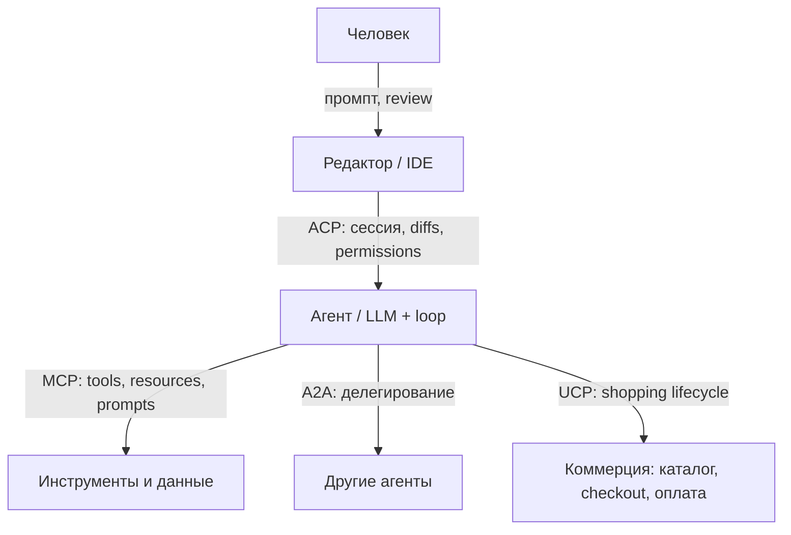
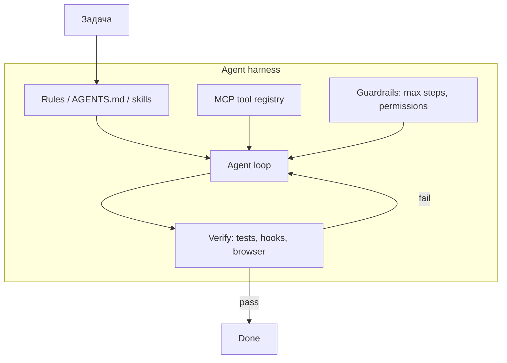

# MCP, ACP, UCP и Agent Harness

## Оглавление

1. [Как объяснить 5-летнему ребёнку](#как-объяснить-5-летнему-ребёнку)
2. [Карта слоёв](#карта-слоёв)
3. [MCP — Model Context Protocol](#mcp--model-context-protocol)
4. [ACP — три разных протокола с одним именем](#acp--три-разных-протокола-с-одним-именем)
5. [UCP — Universal Commerce Protocol](#ucp--universal-commerce-protocol)
6. [Agent Harness](#agent-harness)
7. [Как протоколы входят в harness](#как-протоколы-входят-в-harness)
8. [Как максимально эффективно засетапиться в Cursor](#как-максимально-эффективно-засетапиться-в-cursor)
9. [Мини-демо: naive vs harness](#мини-демо-naive-vs-harness)
10. [Чеклист](#чеклист)
11. [Источники](#источники)

---

## Как объяснить 5-летнему ребёнку

У умного робота есть **руки, комната и правила**.

- **MCP** — розетка одного стандарта: робот втыкает руки в почту, базу, тикеты, браузер, не учась каждому штекеру заново.
- **ACP** (в смысле редактора) — дверь между роботом и твоей комнатой с кодом: робот видит файлы, показывает правки, спрашивает разрешение.
- **UCP** — общий язык магазинов: робот умеет искать товар и оформлять заказ у разных продавцов одинаково.
- **Harness** — поводок и проверка: сколько шагов можно сделать, куда нельзя ходить, и как убедиться, что дело **сделано**, а не только сказано «готово».

Cursor — это уже готовый harness. Настройка — не «включить всё», а повесить правильный поводок: короткие правила, нужные инструменты, проверка после правок.

---

## Карта слоёв

Протоколы **не конкурируют**: каждый закрывает свой стык. Путать их — как сравнивать USB-C и LSP.



| Слой | Вопрос, на который отвечает | Типичный стандарт |
|------|-----------------------------|-------------------|
| Редактор ↔ агент | Где живёт агент и как IDE показывает его работу? | **ACP** = Agent Client Protocol (Zed / JetBrains) |
| Агент ↔ инструменты | Что агент может прочитать и вызвать? | **MCP** = Model Context Protocol |
| Агент ↔ агент | Как агенты находят друг друга и делегируют задачи? | **A2A** (сюда же ушёл старый IBM ACP) |
| Агент ↔ магазин | Как искать, класть в корзину и оформлять заказ? | **UCP** (+ checkout **ACP** от OpenAI/Stripe, оплата **AP2**) |
| Всё вокруг модели | Как не дать агенту врать, зациклиться и слить секреты? | **Agent harness** — это не протокол, а обвязка |

Аналогия со стеком редактора:

- **LSP** даёт IDE язык: автодополнение, диагностика.
- **ACP** сажает coding-агента в эту IDE.
- **MCP** даёт агенту руки: CI, БД, браузер, тикеты.

Harness — это уже продукт: Cursor, Claude Code, Codex. Протоколы — провода. Harness решает, **какие** провода втыкать, сколько шагов разрешать и чем проверять результат.

---

## MCP — Model Context Protocol

**MCP** — открытый стандарт, как агент подключается к внешним системам. Anthropic опубликовал его в конце 2024, затем передал в Agentic AI Foundation при Linux Foundation. Канон и спека: [Model Context Protocol](https://modelcontextprotocol.io/). К 2026 это де-факто USB-C для инструментов: Cursor, Claude, ChatGPT, VS Code, Gemini, Copilot умеют быть MCP-клиентами.

Сервер MCP описывает три примитива:

| Примитив | Смысл | Пример |
|----------|--------|--------|
| **Tools** | Действия, которые модель может вызвать | `create_pr`, `get_build_logs`, `vkusvill_products_search` |
| **Resources** | Данные, которые можно прочитать | схема БД, файл, страница тикета |
| **Prompts** | Готовые шаблоны | «разбери failing CI» |

Транспорт: JSON-RPC по **stdio** (локальный процесс) или **HTTP** (удалённый сервер). Клиент (Cursor) при старте сессии подхватывает список инструментов и кладёт их схемы в контекст модели.

Практические следствия:

1. **Схемы инструментов едят контекст.** Десять MCP с сотней tools — это не «больше силы», а размытый каталог и хуже выбор tool.
2. **MCP ≠ безопасность.** Это канал. Guardrails (allowlist, approval, `beforeMCPExecution`) живут в harness.
3. **MCP ≠ память репозитория.** Правила, `AGENTS.md` и skills — другой слой. MCP нужен, когда агенту надо **сходить во внешний мир**, а не когда надо помнить стиль кода.

Спека 2026-07-28 сдвинула ядро MCP к **stateless request/response** (проще serverless/edge). Для пользователя Cursor это значит: удалённые HTTP-серверы масштабируются как обычные API, а не как вечные сессии.

В Cursor конфиг лежит в двух местах:

- проект: `.cursor/mcp.json`
- пользователь: `~/.cursor/mcp.json`

```json
{
  "mcpServers": {
    "context7": {
      "url": "https://mcp.context7.com/mcp"
    },
    "local-docs": {
      "command": "python",
      "args": ["${workspaceFolder}/tools/mcp_server.py"],
      "env": {
        "API_KEY": "${env:API_KEY}"
      }
    }
  }
}
```

Секреты — в env через Interpolation (подстановка `env:API_KEY` в фигурных скобках, как в конфиге выше), не в правилах и не в промпте. Allowlist инструментов: `mcpAllowlist` в настройках (например `"github:*"`, `"linear:list_issues"`).

---

## ACP — три разных протокола с одним именем

**ACP** в 2026 — ловушка. Одно имя, три несвязанных стандарта.

### 1. Agent Client Protocol (Zed / JetBrains) — про IDE

Это «LSP для агентов». Редактор запускает агента как subprocess и говорит с ним JSON-RPC по stdio: сессия, ходы промпта, стрим прогресса, запрос permission, diffs.

Направление разговора противоположно MCP:

- **ACP:** редактор спрашивает, агент отвечает (и просит разрешение на правку).
- **MCP:** агент спрашивает, tool-сервер отвечает.

Cursor **внутри своего IDE** — собственный harness, не хост ACP как Zed. Зато **Cursor CLI** умеет быть ACP-агентом для других редакторов: `agent acp` (Neovim/avante, Zed, JetBrains). Тогда MCP из `.cursor/mcp.json` едет вместе с агентом; team MCP с дашборда Cursor в ACP-режиме не подхватываются.

Если вы сидите в Cursor Desktop, ACP вам **не нужно включать**. Это протокол «вставить Cursor-агента в чужой редактор» или «вставить Claude Code / Gemini CLI в Zed».

### 2. Agent Communication Protocol (IBM / BeeAI) — устарел

Старый IBM ACP был про **агент ↔ агент**. Его слили в **A2A** (Agent2Agent, Google → Linux Foundation). Карточка агента публикуется как `/.well-known/agent-card.json`. Для настройки Cursor это почти никогда не слой номер один.

### 3. Agentic Commerce Protocol (OpenAI / Stripe) — про checkout

Это стандарт **оплаты/checkout**: агент завершает покупку у мерчанта. К кодированию отношения не имеет. Часто стоит рядом с UCP: UCP описывает весь shopping journey, commerce-ACP — как провести checkout.

Когда в чате говорят «ACP» рядом с Cursor и MCP — почти всегда имеют в виду **Agent Client Protocol**. Когда рядом с UCP и Stripe — **Agentic Commerce Protocol**.

---

## UCP — Universal Commerce Protocol

**UCP** — открытый стандарт полного торгового цикла для агентов: discovery каталога, корзина, checkout, постпокупка. Коалиция вокруг Google, Shopify и ритейл/платёжных партнёров. Профиль мерчанта: `/.well-known/ucp`. Транспортом может быть REST, MCP или A2A — UCP задаёт **типизированные схемы**, а не единственный провод.

Соседние коммерческие слои:

| Протокол | Что стандартизирует |
|----------|---------------------|
| **UCP** | Весь shopping interaction |
| **ACP** (OpenAI/Stripe) | Checkout |
| **AP2** | Кто разрешил платёж: mandates, лимиты, audit trail |
| **MCP** | Как агент вообще достучится до систем мерчанта |

Для ML-инженера и Cursor UCP нужен только если вы **строите shopping-агента**. Это не кнопка в настройках IDE. Его полезно знать, чтобы не искать «UCP plugin for Cursor».

---

## Agent Harness

Каноническое определение в книге — в конспекте [AI Harness Engineering (Tejas, IBM)](../code-agents-autoresearch-and-loopy-era/ai-harness-engineering-tejas-ibm.md). Кратко здесь, без дубля всего доклада.

> **Agent harness** — всё **вокруг** модели, что заземляет её в контролируемой среде: инструменты, контекст, guardrails, цикл агента и шаг **verify**.

Это не ML test harness (набор входов → оценка выходов модели). Это runtime-обвязка.



| Компонент | В Cursor |
|-----------|----------|
| Политика и стиль | `.cursor/rules/*.mdc`, `AGENTS.md`, User Rules |
| Процедуры «как делать X» | `.cursor/skills/*/SKILL.md` |
| Инструменты | MCP, Shell, браузер, Task/subagents |
| Guardrails | permissions, allowlist MCP, hooks `beforeShellExecution` / `beforeMCPExecution` |
| Verify | hooks `afterFileEdit`, тесты, линтер, `kb_validate_links.py` |
| Контекст | индекс репо, `.cursorignore`, не тащить лишнее в alwaysApply |

Ключевой тезис Tejas: **не промптить сильнее, а чинить harness**. Агент на login wall «успешно» кликает upvote и врёт. Лечится не фразой «ты должен быть залогинен», а кодом: секреты вне промпта + детерминированный verify по trace.

Тот же принцип в [Stop Babysitting Your Agents](../code-agents-autoresearch-and-loopy-era/stop-babysitting-your-agents-claude-code.md): ценность не в одном удачном ходе, а в **verification loop** до наблюдаемого успеха.

---

## Как протоколы входят в harness

Harness **выбирает и ограничивает** протоколы.

1. MCP без harness — агент с руками и без тормозов.
2. ACP без MCP — агент в IDE, но без внешних систем (только файлы и терминал редактора).
3. UCP без AP2 — умеет заказывать, не умеет доказать, кто это разрешил.
4. Сильная модель + слабый harness проигрывает средней модели + verify. Это уже repeatable паттерн 2025–2026.

Грубо:

$$\text{надёжность} \approx f(\text{verify}, \text{guardrails}, \text{tool quality}) \gg f(\text{длина system prompt})$$

---

## Как максимально эффективно засетапиться в Cursor

Эффективность здесь — **полезный token throughput**, не «максимум включённых MCP». Контекст — бюджет. Каждая always-on правило и каждая схема tool конкурируют с кодом задачи.

Эта книга сама является примером harness: правила в `.cursor/rules/`, skill визуализаций, hook проверки ссылок после правок.

### 0. Разделить user / project / ephemeral

| Слой | Куда класть | Примеры |
|------|-------------|---------|
| **User** | `~/.cursor/rules`, `~/.cursor/mcp.json`, User Rules в настройках | «отвечай по-русски», личные MCP (почта, календарь) |
| **Project** | `.cursor/rules`, `.cursor/skills`, `.cursor/mcp.json`, `.cursor/hooks.json`, `AGENTS.md` | стиль репо, тесты, запрет коммитить без просьбы |
| **Сессия** | чат, Plan, @файлы, Notepads | «сегодня чиним только NMS» |

Не кладите проектные конвенции в User Rules: они утекут в чужие репозитории и наоборот.

### 1. Rules — короткие, по одному поводу

Файлы `.cursor/rules/*.mdc`:

```yaml
---
description: Что делает правило (видно в picker)
globs: topics/**/*.md
alwaysApply: false
---
```

Правила большого пальца:

- **alwaysApply** только для того, без чего агент ломает репо (язык ответов, «не коммитить без просьбы», канонические заголовки).
- Остальное — **globs**: Python-скрипты топиков, markdown книги, фронтенд.
- Цель — **< 50 строк на правило**, одно concern. Длинный учебник кладите в топик или skill, не в always-on.
- Пишите **действия**, не эссе: «перед новым топиком — grep по `topics/**/*.md`», а не «старайся не дублировать».

`AGENTS.md` в корне — карта репо для агента (и Cloud Agent): как устроена книга, куда класть файлы, какие команды гонять. Вложенные `AGENTS.md` в поддиректориях перекрывают общее. Это не замена rules: AGENTS.md — ориентация, rules — инварианты.

### 2. Skills — процедуры, которые не должны висеть всегда

Skill (`.cursor/skills/<name>/SKILL.md`) подхватывается, когда задача на него похожа. Сюда относятся: «сделай клип к теме» (kb-video, HyperFrames), «разбери YouTube», «создай rule».

Хороший skill:

- в `description` — **когда вызывать**, не только что это такое;
- тело — шаги, пути, команды;
- тяжёлые референсы — в `reference.md`, не в always-on rule.

Личные skills: `~/.cursor/skills/`. Проектные — в репозитории. Каталог `~/.cursor/skills-cursor/` — внутренний, туда не писать.

### 3. MCP — два-три сервера, которые вы зовёте каждую неделю

Порядок подключения:

1. Составить список **реальных** внешних действий: тикеты, доки библиотек, браузер, внутренняя БД.
2. Включить **только их**. Остальное — по запросу.
3. Проверить, что агент **видит** tools (Cursor Settings → MCP, approve).
4. Сузить allowlist. Org-admin токен хуже узкого.
5. Для docs-библиотек удобен Context7-подобный MCP: агент читает актуальную спеку, а не память модели.

Anti-pattern: «каталог из 20 MCP на всякий случай». Схемы займут окно, модель начнёт звать не тот tool.

Браузерный MCP / Playwright имеет смысл, если агент **проверяет UI**. Для этой книги verify — скрипты и `kb_validate_links.py`, браузер не нужен.

### 4. Hooks — детерминированный verify

Hooks — ближайший аналог «verify step» Tejas внутри Cursor: скрипт на событии агента, JSON stdin/stdout, можно **запретить** действие.

Полезный минимум:

| Событие | Зачем |
|---------|--------|
| `afterFileEdit` | форматтер, проверка ссылок (как `.cursor/hooks.json` в этой книге) |
| `beforeShellExecution` | спросить перед `rm`, `curl`, опасным git |
| `beforeMCPExecution` | не пускать MCP с секретами/продом без approve |
| `beforeSubmitPrompt` | не отправлять ключи из буфера |

Проектные hooks коммитятся: `.cursor/hooks.json` + `.cursor/hooks/*.sh`. Скрипт должен быть исполняемым, с shebang. Matcher — JS-regex; если сомневаетесь, сначала без matcher.

Это **сильнее**, чем правило «пожалуйста, запусти тесты»: правило можно забыть, hook срабатывает всегда.

### 5. Контекст репозитория

- `.cursorignore` / `.gitignore`: не индексировать `node_modules`, веса, огромные `outputs/`, бинарники.
- `@`-упоминания точечно: лучше `@topics/foo/README.md`, чем «прочитай весь репо».
- Plan mode — когда есть развилка (новый топик vs дополнить старый). Agent mode — когда план ясен.
- Subagents (`explore`, узкий grep) — для поиска, не для «сделай всю книгу».
- Не копируйте в чат то, что уже есть в rules: повторение жрёт контекст и иногда **ослабляет** правило (модель видит два варианта).

### 6. Модель, режимы, параллелизм

- Сложный рефактор / архитектура — сильная модель в Agent.
- Рутина по шаблону skill — быстрее и дешевле.
- Несколько независимых веток — несколько чатов или Cloud Agent, а не один бесконечный тред (context rot; см. Ralph Loop в [code-agents](../code-agents-autoresearch-and-loopy-era/README.md)).
- Критерий «готово» должен быть **наблюдаемым**: тесты, хук, скриншот, не «агент сказал ok».

### 7. Чего не делать

- Секреты в User Rules, `AGENTS.md`, промпте, git.
- alwaysApply на 800 строк «как устроена вселенная».
- Дублировать одно и то же в rule + skill + README без ссылки на канон.
- Включать MCP «для статуса».
- Путать ACP/UCP с настройкой Cursor Desktop: для IDE-работы вам нужны **rules + skills + MCP + hooks**.

### Практический порядок на новый репозиторий

1. `AGENTS.md`: что это за проект, команды (`uv run pytest`, линтер), куда класть файлы.
2. 2–4 project rules: язык, git, структура, доменные инварианты.
3. Один skill на самый частый ритуал команды.
4. Один MCP, без которого больно (тикеты **или** актуальные доки, не оба «на всякий»).
5. Один hook: то, что агент врёт чаще всего (тесты не гонял, сломал ссылки, не прогнал formatter).
6. Пользоваться неделю. Выкинуть то, что не сработало. Только потом добавлять.

---

## Мини-демо: naive vs harness

Скрипт [`scripts/01_naive_vs_harness.py`](./scripts/01_naive_vs_harness.py) повторяет сюжет Tejas без LLM: страница логина, клик upvote, ложный success vs секреты + verify.

Ожидаемый сигнал: у naive `success_rate = 0` и `truthfulness = 0`; у harness оба равны `1`.

```bash
uv run pytest topics/agent-protocols-mcp-acp-ucp-and-harness/tests
```

Это учебная модель мира, не MCP-сервер. Смысл — увидеть, что **verify смотрит на side effect**, а не на слова агента. Тот же паттерн в Cursor: hook/`pytest`, а не «агент уверен, что всё зелёное».

---

## Чеклист

- [ ] Понимаю слой: MCP = инструменты, ACP(Zed) = агент в IDE, UCP = коммерция, harness = обвязка.
- [ ] Не путаю три ACP.
- [ ] User vs project: личное не в репо, репо не в User Rules.
- [ ] alwaysApply короткий; процедуры — skills; внешний мир — 1–3 MCP.
- [ ] Есть хотя бы один детерминированный verify (hook или обязательные тесты).
- [ ] Секреты в env, не в промпте.
- [ ] `.cursorignore` отсекает мусор из индекса.
- [ ] Критерий done наблюдаемый.

---

## Источники

### В этой книге

- [Code Agents, AutoResearch и Loopy Era](../code-agents-autoresearch-and-loopy-era/README.md) — оркестрация, Ralph Loop, token throughput
- [AI Harness Engineering (Tejas, IBM)](../code-agents-autoresearch-and-loopy-era/ai-harness-engineering-tejas-ibm.md) — определение harness, verify, demo без усиления промпта
- [Stop Babysitting Your Agents (Claude Code)](../code-agents-autoresearch-and-loopy-era/stop-babysitting-your-agents-claude-code.md) — verification loop, skills, MCP как руки инженера
- [Retrieval-Augmented Generation (RAG)](../retrieval-augmented-generation-rag/README.md) — другой способ подмешать внешнее знание (поиск), не tool-protocol
- [System Design для CV и NLP](../ml-system-design-for-cv-and-nlp/README.md) — ёмкость и serving; harness — соседний слой надёжности

### Внешние материалы

- [MCP spec / блог 2026-07-28](https://blog.modelcontextprotocol.io/posts/2026-07-28/)
- [Cursor: MCP](https://cursor.com/docs/mcp)
- [Cursor: rules / AGENTS.md](https://cursor.com/docs/rules)
- [Cursor: hooks](https://cursor.com/docs/hooks)
- [Cursor CLI: ACP](https://cursor.com/docs/cli/acp)
- [Zed: Agent Client Protocol](https://zed.dev/acp)
- [Google: Developer’s Guide to AI Agent Protocols](https://developers.googleblog.com/developers-guide-to-ai-agent-protocols/)
- [CircleCI: ACP vs MCP](https://circleci.com/blog/acp-vs-mcp-whats-the-difference-for-agentic-coding/)
- [Inriver: ACP, UCP, MCP в shopping-агентах](https://www.inriver.com/resources/protocol-ai-shopping-agents-acp-ucp-mcp/)
