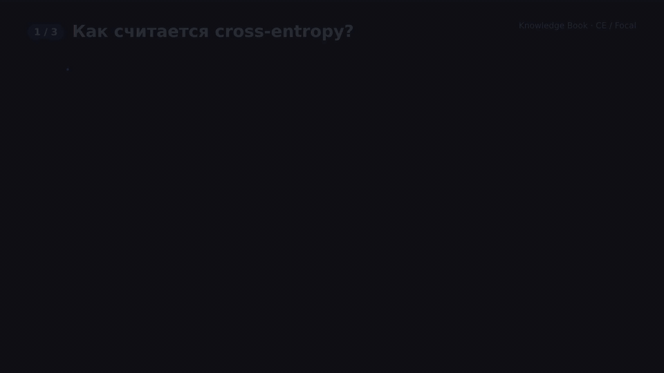

# Cross Entropy и Focal Loss в задачах классификации и детекции

## Оглавление

1. [Интуиция: что делает функция потерь в классификации](#1-интуиция-что-делает-функция-потерь-в-классификации)
2. [Cross Entropy (кросс-энтропия)](#2-cross-entropy-кросс-энтропия)
   - [2.1. Бинарная классификация](#21-бинарная-классификация)
   - [2.2. Многоклассовая классификация (softmax + cross entropy)](#22-многоклассовая-классификация-softmax--cross-entropy)
   - [2.3. Почему Cross Entropy так популярна](#23-почему-cross-entropy-так-популярна)
3. [Focal Loss](#3-focal-loss)
   - [3.1. Мотивация: дисбаланс классов и лёгкие/сложные примеры](#31-мотивация-дисбаланс-классов-и-лёгкиесложные-примеры)
   - [3.2. Формула (бинарный случай)](#32-формула-бинарный-случай)
   - [3.3. Применение (object detection, сегментация)](#33-применение-object-detection-сегментация)
4. [Cross Entropy vs Focal Loss: когда что использовать](#4-cross-entropy-vs-focal-loss-когда-что-использовать)
5. [Как бы я объяснил это 5-летнему ребёнку](#5-как-бы-я-объяснил-это-5-летнему-ребёнку)
6. [Источники](#6-источники)

---

## 1. Интуиция: что делает функция потерь в классификации

В задачах классификации модель предсказывает распределение вероятностей по классам. Функция потерь:

- сравнивает предсказанное распределение $p_\theta(y|x)$ с истинным распределением (обычно one‑hot);
- штрафует модель сильнее, когда она **уверенно ошибается**;
- подталкивает веса так, чтобы вероятность правильного класса росла.

Ключевая идея: хорошая функция потерь должна быть:

- **дифференцируемой** (для градиентного спуска);
- **чувствительной к уверенным ошибкам**;
- **устойчивой** и хорошо ведущей себя при обучении.

---

## 2. Cross Entropy (кросс-энтропия)

Кросс‑энтропия измеряет «расстояние» между истинным распределением меток и предсказанным распределением модели.

### 2.1. Бинарная классификация

Пусть целевая метка $y \in \{0, 1\}$, а модель предсказывает вероятность положительного класса $p = p_\theta(y=1|x)$ (после сигмоиды).

**Binary Cross Entropy (логистическая потеря):**

$$
\mathcal{L}_{BCE}(y, p) = - \big( y \log p + (1 - y) \log (1 - p) \big).
$$

Интуиция:

- если $y = 1$, остаётся $-\log p$ → чем больше $p$, тем меньше потеря;
- если $y = 0$, остаётся $-\log(1-p)$ → чем меньше $p$, тем меньше потеря.

Модель поощряется за высокую вероятность правильного класса и сильно штрафуется за уверенные ошибки.

### 2.2. Многоклассовая классификация (softmax + cross entropy)

Пусть классов $K$, истинная метка — one‑hot вектор $\mathbf{y} = (y_1, \dots, y_K)$, где ровно один компонент равен 1. Модель предсказывает вероятности $\mathbf{p} = (p_1, \dots, p_K)$ после softmax.

**Softmax:**

$$
p_k = \frac{\exp(z_k)}{\sum_{j=1}^K \exp(z_j)},
$$

где $z_k$ — логиты (сырые выходы модели).

**Кросс‑энтропия:**

$$
\mathcal{L}_{CE}(\mathbf{y}, \mathbf{p}) = - \sum_{k=1}^K y_k \log p_k.
$$

Так как только один $y_k = 1$, фактически:

$$
\mathcal{L}_{CE} = -\log p_{y^{*}},
$$

где $y^{*}$ — индекс правильного класса.

### 2.3. Почему Cross Entropy так популярна

- напрямую максимизирует правдоподобие правильных меток (MLE);
- даёт удобные и стабильные градиенты;
- сильно штрафует **уверенные ошибки** (когда модель уверена в неправильном классе);
- просто реализуется в фреймворках (PyTorch: `nn.CrossEntropyLoss`, `nn.BCEWithLogitsLoss`).

Типичные задачи:

- изображение → класс (ImageNet, CIFAR);
- текст → класс (sentiment, topic classification);
- pixel‑wise классификация в сегментации (per‑pixel cross entropy).

---

## 3. Focal Loss

### 3.1. Мотивация: дисбаланс классов и лёгкие/сложные примеры

В задачах детекции и сегментации часто есть **сильный дисбаланс**:

- очень много «лёгких» негативных примеров (фон, пустые области);
- мало «сложных» и важных примеров (объекты, маленькие объекты, редкие классы).

Обычная кросс‑энтропия:

- одинаково учитывает все примеры;
- в дисбалансных задачах градиенты могут быть доминированы **массовыми лёгкими негативами**, которые модель уже хорошо классифицирует;
- это мешает эффективно учиться на сложных примерах.

Focal Loss была предложена в работе про RetinaNet (Lin et al., ICCV 2017), чтобы:

- **подавить вклад лёгких примеров**;
- **усилить вклад сложных примеров** (где модель сильно ошибается).

### 3.2. Формула (бинарный случай)

Пусть $p$ — предсказанная вероятность **правильного класса** для данного примера:

- если $y = 1$, то $p = p_\theta(y=1|x)$;
- если $y = 0$, то обычно берут $p = 1 - p_\theta(y=1|x)$.

Тогда **Focal Loss**:

$$
\mathcal{L}_{FL}(p) = -\alpha (1 - p)^\gamma \log(p),
$$

где:

- $\alpha \in (0, 1)$ — весовой коэффициент между позитивами и негативами (для учёта дисбаланса классов; в RetinaNet $\alpha = 0.25$);
- $\gamma \ge 0$ — focusing parameter (обычно 1–5; в RetinaNet лучше всего сработало $\gamma = 2$).

Интуиция:

- когда пример **лёгкий** и модель даёт большую вероятность правильного класса ($p \approx 1$):
  - $(1 - p)^\gamma \approx 0$ → вклад примера в loss почти обнуляется;
- когда пример **сложный** и $p$ низкое:
  - $(1 - p)^\gamma$ близко к 1 → loss почти такой же, как у обычной CE;
  - сложные примеры дают большой вклад в градиент.

При $\gamma = 0$ Focal Loss превращается в обычную кросс‑энтропию (с весом $\alpha$).

### 3.3. Применение (object detection, сегментация)

- **Object detection**:
  - RetinaNet использует Focal Loss для классификации anchor’ов;
  - огромная часть anchor’ов — фон (легко классифицируемые негативы);
  - Focal Loss концентрируется на трудных anchor’ах (маленькие объекты, частичные перекрытия).
- **Сегментация**:
  - при сильном дисбалансе между классом фона и редким объектом;
  - Focal Loss помогает уделять больше внимания редким пикселям объекта.
- **Любые дисбалансные классификации**:
  - fraud detection, rare events, medical imaging и т.п.

---

## 4. Cross Entropy vs Focal Loss: когда что использовать

- **Cross Entropy**:
  - стандарт по умолчанию для сбалансированных задач классификации;
  - хороша, когда доля классов более‑менее сопоставима;
  - проще и дешевле по вычислениям.

- **Focal Loss**:
  - когда есть сильный **дисбаланс** классов и много лёгких негативов;
  - когда модель быстро «выучивает» большую часть примеров, но продолжает плохо работать на редких/сложных;
  - особенно полезна в object detection и dense prediction задачах (segmentation, keypoint detection).

Можно комбинировать:

- использовать Focal Loss для классификационной части (objectness / class logits);
- одновременно использовать другие потери (L1, Smooth L1, IoU) для регрессии боксов.

---

## 5. Как бы я объяснил это 5-летнему ребёнку

- Cross Entropy — это как учитель, который очень сердится, когда ты **уверенно говоришь глупость**. Если ты был почти уверен и ошибся, наказание большое; если сомневался — поменьше.
- Focal Loss — это учитель, который говорит:  
  «Лёгкие задачки мы уже умеем, давайте я буду меньше обращать внимание на них и больше смотреть на те, где вы часто ошибаетесь».  
  То есть он меньше замечает простые правильные ответы и сильнее фокусируется на сложных примерах.

**Визуализация (HyperFrames, 43 с):** сцена 1 — логиты → softmax → cross-entropy −log py* и кривая потери по p; сцена 2 — Focal Loss (1 − p)γ·CE: кривые для γ = 0, 1, 2, 5, множитель для лёгких и сложных примеров, роль α; сцена 3 — когда выбирать CE, а когда Focal (RetinaNet, dense prediction).

*Полная версия: [MP4 1080p](./assets/visualizations/cross-entropy-vs-focal-loss.mp4) · сториборд и исходники сцен: [`visualizations/hyperframes/`](./visualizations/hyperframes/storyboard.md).*

---

## 6. Источники

- **Связанные документы в этом knowledge‑book**:
  - [`non-maximum-suppression-nms`](../non-maximum-suppression-nms/README.md) — подробно про пайплайны object detection, где Focal Loss часто используется совместно с NMS или end‑to‑end детекторами.
  - [`convolutions-and-parameters-in-cnn`](../convolutions-and-parameters-in-cnn/README.md) — свёрточные сети, которые обычно стоят перед классификационными head’ами с Cross Entropy или Focal Loss.
  - [`deep-reinforcement-learning`](../deep-reinforcement-learning/README.md) — в некоторых алгоритмах RL для policy‑head’ов также используют кросс‑энтропию или её варианты.
- **Внешние материалы**:
  - [Lin T.-Y. et al. «Focal Loss for Dense Object Detection» (ICCV 2017, RetinaNet)](https://arxiv.org/abs/1708.02002)
  - [PyTorch: `torch.nn.CrossEntropyLoss`](https://pytorch.org/docs/stable/generated/torch.nn.CrossEntropyLoss.html), [`torchvision.ops.sigmoid_focal_loss`](https://pytorch.org/vision/stable/generated/torchvision.ops.sigmoid_focal_loss.html)
