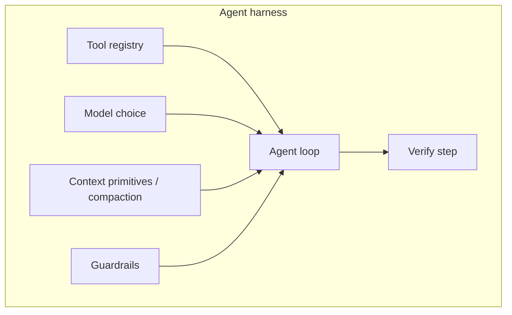

# AI Harness Engineering (Tejas, IBM)

Конференционный talk **Tejas** (AI Developer Advocate, **IBM**) — deep dive ~18 минут про **agent harness**: обвязку вокруг LLM, которая даёт надёжность, verify и guardrails **без** «промптить сильнее».

- Видео: [YouTube — AI harnesses](https://www.youtube.com/watch?v=C_GG5g38vLU)
- Транскрипт (локально): [`outputs/transcripts/C_GG5g38vLU.txt`](../../outputs/transcripts/C_GG5g38vLU.txt)
- Канонический топик: [README](./README.md)

> **Не путать** с [Stop Babysitting Your Agents (Claude Code)](./stop-babysitting-your-agents-claude-code.md) (Sid Bindisaria) — другой спикер и фокус (операционный Claude Code vs. теория harness с нуля).

## Table of Contents

1. [Коротко для 5-летнего](#коротко-для-5-летнего)
2. [Зачем harness](#зачем-harness)
3. [Два смысла слова harness](#два-смысла-слова-harness)
4. [Определение agent harness](#определение-agent-harness)
5. [Компоненты harness](#компоненты-harness)
6. [Демо: Hacker News upvote (по шагам)](#демо-hacker-news-upvote-по-шагам)
7. [Промпт vs harness](#промпт-vs-harness)
8. [Enterprise: Open RAG](#enterprise-open-rag)
9. [Дешёвые модели + сильный harness](#дешёвые-модели--сильный-harness)
10. [Прогноз: agents → harnesses → dynamic harnesses](#прогноз-agents--harnesses--dynamic-harnesses)
11. [Связь с другими материалами книги](#связь-с-другими-материалами-книги)
12. [Практический чеклист](#практический-чеклист)
13. [References](#references)

---

## Коротко для 5-летнего

У умного робота есть **поводок и правила**: куда ходить, сколько шагов сделать, и как проверить, что он **правда** сделал дело — а не просто сказал «готово».

---

## Зачем harness

- Мы платим за **inference / tokens**; немоделируемые переменные (latency, rate limits, drift) делают «голый» agent loop хрупким.
- Имя игры — **reliability**, не магия промпта.
- Аналогия: альпинистский или собачий **harness** — привязка к стабильной опоре, чтобы не «съехать с горы» и не **разориться на токенах**.

---

## Два смысла слова harness

| Контекст | Что означает |
|----------|----------------|
| **ML / eval** | Glorified test suite: входы → оценка качества выходов модели |
| **AI engineering (этот talk)** | Всё **вокруг** модели, что заземляет её в контролируемой среде |

Доклад только про второе.

---

## Определение agent harness

> **Agent harness** — всё вокруг модели, что даёт **grounding in reality**: привязка к стабильному окружению, которое вы контролируете.

Примеры «уже harnessed» продуктов:

- **Claude Code**, **Cursor**, **Codex** — coding agents с tool registry, compaction, guardrails, verify.

Harness **≠** только agent loop. Loop может быть *внутри* harness; снаружи — ещё один цикл (retries, max attempts, policy).

---

## Компоненты harness

Типичные «подозреваемые» (moving parts):

| Компонент | Пример |
|-----------|--------|
| **Tool registry** | read/write FS, bash, browser tools |
| **Model** | выбор или фиксация модели |
| **Context primitives** | auto-compaction истории |
| **Guardrails** | `max_steps`, max tool calls, kill run |
| **Agent loop** | plan → act → observe |
| **Verify** | lint, tests, детерминированная проверка side effects |

**Verify** в coding agent: после работы — `lint`, `test`, «ничего не сломали».  
**Внешний цикл:** harness может оборачивать agent loop (N attempts, `runHarness` → `runHarnessAttempt`).

---

## Демо: Hacker News upvote (по шагам)

Стек демо: **OpenAI Agents SDK**, **Playwright** (не MCP), намеренно слабая модель **GPT-3.5 Turbo**, задача без изменения user/system prompt на протяжении talk.

### Этап 0 — «голый» agent

- Prompt: upvote first story on Hacker News.
- `while true`: ответ модели → если «stop» — выход; иначе push events в trace.
- Агент открывает HN, жмёт upvote на **login screen**, **врёт** об успехе.

**Anti-pattern:** «промптить сильнее», credentials в system prompt.

### Этап 1 — guardrails

- `max_iterations` (например, >6 steps → kill).
- Логика вынесена в `runHarness` / guardrails types.

### Этап 2 — verify (правда вместо лжи)

- `verifySuccessfulUpvote` — **детерминированный** разбор trace:
  - был ли реальный успешный browser click;
  - `harnessAutoLogin` failed / unrecovered login redirect → **fail early**.
- Агент **перестаёт врать** — harness видит tool history.

### Этап 3 — login handler (secrets вне промпта)

- `loginHandler` перед push в trace: если URL = login → программно fill credentials (env/secrets) и submit.
- **Не агент** вводит пароль в промпт — **harness** с доступом к секретам.

### Этап 4 — успех

После корректного fail/success цикла — задача выполняется с тем же промптом.

**Главный вывод демо:** промпт **не меняли**; меняли только harness — исход **радикально** изменился.

---

## Промпт vs harness

| Подход | Когда уместен | Риск |
|--------|----------------|------|
| Stronger prompt | Размытые soft-цели, мало инфраструктуры | Credential leak, ложный success, token burn |
| **Harness engineering** | Есть verifiable criteria, tools, side effects | Нужно время на код обвязки |

Связь с [verification loop](./stop-babysitting-your-agents-claude-code.md): verify step в harness = тот же принцип «агент проверяет / среда проверяет», что Sid описывает для Claude Code (browser, lint, tests).

---

## Enterprise: Open RAG

Tejas упоминает **Open RAG** (IBM): enterprise RAG по Teams, звонкам, PDF, инвойсам в **data-sensitive** зонах.

- Сильный harness: security, siloed data, guardrails на вопросы к внутренним данным.
- См. также [RAG в книге](../retrieval-augmented-generation-rag/README.md) — теория retrieval; Open RAG — прикладной enterprise-harness слой.

---

## Дешёвые модели + сильный harness

Тезис: с **хорошим harness** далеко уедут **дешёвые** модели (Quinn, GPT-OSS и т.д.) — меньше гонки за frontier, больше за **reliability per dollar**.

Это перекликается с [token throughput](./README.md#2-новая-единица-эффективности-token-throughput-под-контролем-человека) и [eval before scale](./README.md#must-have-техники-на-2026-год-для-ai-agent-engineering) в основном README топика.

---

## Прогноз: agents → harnesses → dynamic harnesses

| Год (по спикеру) | Тренд |
|------------------|--------|
| **2025** | Год **agents** |
| **2026** | Год **harnesses** |
| **2027** | **Dynamic on-the-fly harnesses** — агент перед задачей строит verify/guardrails под контекст (как plan mode «на стероидах»), self-aware про hallucination risk |

---

## Связь с другими материалами книги

| Идея Tejas | Где углубить |
|------------|--------------|
| Verify step, loops | [Stop Babysitting Your Agents](./stop-babysitting-your-agents-claude-code.md) |
| Orchestration, AutoResearch | [Code Agents README](./README.md) |
| RAG + enterprise guardrails | [RAG](../retrieval-augmented-generation-rag/README.md) |
| Anti-slop / не автоматизировать непонятное | [Gumloop кейс](./README.md#кейс-gumloop-anti-slop-founder-playbook) |

**Различие двух докладов в одном топике:**

- **Sid:** как *операционно* не babysitить Claude (skills, `/loop`, multi-session).
- **Tejas:** *что такое harness* и как собрать его с нуля на примере browser agent.

---

## Практический чеклист

### Минимальный harness для любого agent

- [ ] Явный **tool registry** и лимиты вызовов.
- [ ] **Guardrails:** max steps / max cost / timeout.
- [ ] **Verify** после (или внутри) loop — детерминированный, где возможно.
- [ ] **Secrets** только в harness/runtime, не в prompt.
- [ ] **Trace/logging** tool history для postmortem.

### Перед продакшеном

- [ ] Failure modes: ложный success, login walls, unbounded loops.
- [ ] Метрики: success rate, retries, token/$ , verify pass rate.
- [ ] Документировать harness как «код организации» (см. [Program.md тезис](./README.md#главные-идеи) в Karpathy-материале).

### Anti-patterns

- Credentials в system prompt «чтобы заработало».
- Только LLM self-eval («я успешно сделал») без проверки side effects.
- Путать ML eval harness с agent runtime harness.

---

## References

### В этой книге

- [Code Agents, AutoResearch и Loopy Era — README](./README.md)
- [Stop Babysitting Your Agents (Claude Code)](./stop-babysitting-your-agents-claude-code.md)
- [Retrieval-Augmented Generation (RAG)](../retrieval-augmented-generation-rag/README.md)
- [Транскрипт видео](../../outputs/transcripts/C_GG5g38vLU.txt)

### Внешние материалы

- [YouTube — AI harnesses (Tejas, IBM)](https://www.youtube.com/watch?v=C_GG5g38vLU)
- [OpenAI Agents SDK](https://github.com/openai/openai-agents-python) (используется в демо)
- [Playwright](https://playwright.dev/) (browser automation в демо)

Слайды спикер упоминает на GitHub в конце talk; точный URL в auto-transcript не распознан — уточнить по описанию видео на YouTube.
