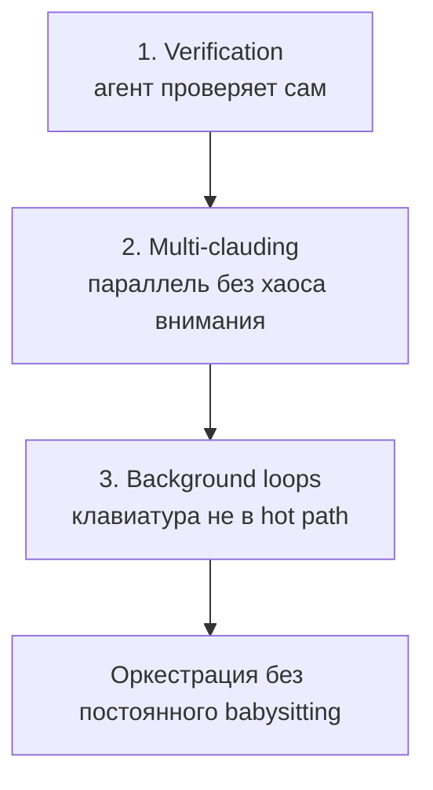
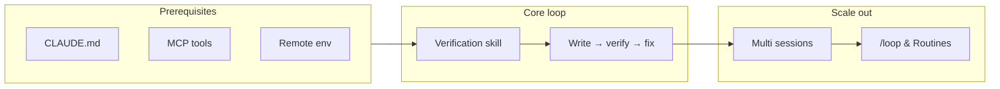

# Stop Babysitting Your Agents (Claude Code)

Доклад **Sid Bindisaria** (founding engineer Claude Code) — практический playbook уровня «Claude Code 301»: как перестать быть glorified QA и вернуть время за счёт **verification loops**, **параллельных сессий** и **фоновых рутин**.

- Видео: [Stop babysitting your agents](https://www.youtube.com/watch?v=wI0ptqCSL0I)
- Канонический обзор темы агентов и loops: [README](./README.md)

## Table of Contents

1. [Коротко для 5-летнего](#коротко-для-5-летнего)
2. [Зачем менять tooling](#зачем-менять-tooling)
3. [Prerequisites (table stakes)](#prerequisites-table-stakes)
4. [Три столпа доклада](#три-столпа-доклада)
5. [Verification: playbook человека = playbook агента](#verification-playbook-человека--playbook-агента)
6. [Loop как главный механизм](#loop-как-главный-механизм)
7. [Четыре шага UX verification loop](#четыре-шага-ux-verification-loop)
8. [Skills: упаковка и самоулучшение](#skills-упаковка-и-самоулучшение)
9. [Multi-clauding: масштаб без перегруза внимания](#multi-clauding-масштаб-без-перегруза-внимания)
10. [Background loops: `/loop` и Routines](#background-loops-loop-и-routines)
11. [Стек целиком](#стек-целиком)
12. [Практический чеклист](#практический-чеклист)
13. [Связь с Ralph / AutoResearch](#связь-с-ralph--autoresearch)
14. [References](#references)

---

## Коротко для 5-летнего

Раньше ты сам проверял каждую деталь робота. Теперь ты учишь робота **самому проверять работу**, запускаешь несколько роботов параллельно и иногда говоришь: «каждые 10 минут смотри, всё ли в порядке» — а сам занимаешься тем, что действительно важно.

---

## Зачем менять tooling

Большинство инструментов (линтеры, IDE, Prettier, type checkers, компиляторы) проектировали под **людей**. Сейчас значительная часть кода пишется **агентами**.

- **Хорошая новость:** многие human-tools (prettier, linters, symbol servers) агенты используют эффективно.
- **Плохая новость:** у людей есть неявные допущения о toolchain, которых у агента нет.

Ключевой вопрос доклада:

> Что агенту нужно из вашего codebase, что человек считает само собой разумеющимся?

Цель «не babysitить» — дать агенту инструменты и инструкции, чтобы он **hill-climb** к success criteria без постоянного микроменеджмента.

---

## Prerequisites (table stakes)

Перед продвинутыми техниками Sid рекомендует три базовых шага:

| # | Практика | Зачем |
|---|----------|--------|
| 1 | Качественный **CLAUDE.md** | Самый высокий leverage для качества сессий |
| 2 | **MCP / интеграции** (Slack, Linear, Asana, Datadog, BigQuery…) | Богатый контекст и действия «как у инженера» |
| 3 | **Remote environment** (Claude Code Web) | Compute отвязан от ноутбука; сессии живут при закрытой крышке |

Правило: если инструмент полезен вам в day-to-day, он полезен и агенту.

---

## Три столпа доклада



1. **Verification** — научить Claude проверять свою работу (build, run, browser, tests, side effects).
2. **Multi-clauding** — много сессий параллельно, когда verification надёжен.
3. **Background loops** — рутины (PR, CI, docs, triage) по расписанию без вас в цикле.

---

## Verification: playbook человека = playbook агента

Типичная последовательность проверки работы инженера (любое подмножество шагов):

1. Спроектировать и написать код.
2. **Собрать** (compiler, type checker) → при ошибке вернуться к коду.
3. **Запустить** executable (Docker, CLI, dev server).
4. **Проверить side effects:** UI в браузере, логи, состояние БД.
5. **Unit tests** + новый тест на фичу.
6. **Deploy staging** (или prod).

Тот же playbook работает для Claude, если дать **tools + instructions**. Различие только в UX / backend / E2E — **концепция loop одна**.

---

## Loop как главный механизм

**Loop** — автономный контур: агент пишет код → проверяет → при failure отлаживает → повторяет до **success state**.

Пример из доклада (личный сайт, сломанная кнопка Sign up):

- написал код → собрал → кликнул в браузере → увидел, что не работает;
- прочитал логи → исправил → перезагрузил → повторил до рабочего PR.

**Takeaway:** везде, где возможно, цель — ввести агента в loop с явными критериями успеха, а не разовый «сделай фичу».

Связь с [Ralph Loop в основном README](./README.md#ralph-loop-что-это-и-какие-разновидности-бывают): Ralph — обобщённый паттерн «повторять до done»; здесь — конкретная инженерная реализация через dev server, browser MCP и skills.

---

## Четыре шага UX verification loop

Для фронтенда (аналогично переносится на backend/E2E):

| Шаг | Действие | Пример |
|-----|----------|--------|
| **Run** | Поднять приложение | `npm run dev`, docker compose |
| **Use** | Управлять приложением | Chrome MCP (`/chrome`), Playwright |
| **Prove** | Доказать, что работает | Скриншоты до/после фикса |
| **Unblock** | Снять блокеры | Auth identity для агента, seed state (inventory, fixtures) |

### Unblock: auth и state

- **Auth** — выдать агенту identity для логина (как в E2E).
- **State** — динамические setup-скрипты (не только статические fixtures), чтобы агент мог готовить разные сценарии.

Отличие от классических E2E: скрипты должны быть **доступны агенту** и достаточно **гибкими**, не только жёстко зашитыми.

### Демо (MonkeyType)

На [monkeytype.com](https://monkeytype.com) (TypeScript, Express, MongoDB, Redis):

1. Dev server + Chrome MCP: набор, settings, persistence.
2. Сессия → «вынеси learnings в skill» → `demo-verification` skill.
3. Фича «confetti при опечатке» + **автоверификация через skill** + автофикс lint (oxlint).

---

## Skills: упаковка и самоулучшение

**Skill** — переиспользуемый контекст по теме (здесь — verification loop).

Рекомендуемая структура skill (по демо):

1. Bring up stack (команды docker compose / dev server).
2. Enable browser tools (Chrome MCP).
3. Smoke test (навигация, ввод, settings, assertions).

**Self-improving skill:** в skill явно указать — при каждом blocker документировать решение в том же skill. Команда Claude Code использует **один** team-wide verification skill с этим правилом.

Промпт-шаблон после ручной сессии:

```text
Take everything we learned and put it into a skill file for <project> verification.
```

Затем на новые фичи:

```text
Implement <feature> and use the verification skill we created to verify your work.
```

---

## Multi-clauding: масштаб без перегруза внимания

**Проблема:** $>4$–$5$ открытых сессий — attention становится узким местом.

| Инструмент | Назначение |
|------------|------------|
| **Claude Code Desktop** | Sidebar всех сессий (local, cloud, repos); pin, rename, color |
| **`claude agents`** (terminal) | Agent view: сортировка по «нужно внимание» vs «running/done» |
| **Claude Code on the Web** | Compute в облаке; ноутбук не обязателен |
| **`/remote-control`** | Управление сессией с телефона + push при запросе input |

Старый паттерн: tmux + git worktrees вручную — работает, но тяжело в operational overhead.

**Совет:** именовать и пинить сессии осмысленно — это защита attention, не косметика.

---

## Background loops: `/loop` и Routines

Задачи, которые **не требуют** вас в hot path каждую минуту:

- babysitting PR (review comments, merge conflicts, CI);
- обновление docs;
- triage feedback / issues;
- держать CI green.

### `/loop` (локально)

Периодически будит сессию и выполняет prompt:

```text
/loop 10 minutes babysit my open prs
```

При настроенных CLAUDE.md + tools агент сам разбирается с открытыми PR.

### Routines (облако)

То же, что `/loop`, но в **remote container** (Claude Code Web / desktop):

- time-based trigger (например, docs daily);
- event-based trigger;
- примеры команды: docs update daily, issues/feedback → Slack каждые 6 часов.

---

## Стек целиком



Итог: вы тратите attention на задачи с высоким judgment; остальное делегируется с **проверяемым** success criteria.

---

## Практический чеклист

### Неделя 1 — verification

- [ ] Написать/обновить CLAUDE.md (build, test, dev server, quality gates).
- [ ] Подключить 1–2 MCP, реально используемых в работе (issue tracker, CI, browser).
- [ ] Один раз **вручную** провести агента через verify (run → browser/CLI → prove).
- [ ] Сохранить сессию в **verification skill** с smoke test.
- [ ] Добавить в skill: «при blocker — обнови этот skill».

### Неделя 2 — multi-clauding

- [ ] Попробовать Desktop или `claude agents`; лимит ~4–5 активных сессий.
- [ ] Разнести независимые задачи по worktrees/веткам.
- [ ] Включить remote env для одной длинной задачи.

### Неделя 3 — background

- [ ] `/loop` на один рутинный prompt (open PRs или CI triage).
- [ ] Одна Routine в облаке (docs или feedback digest).

### Anti-patterns (из доклада + общая loopy-era логика)

- Ручной babysitting каждого file edit без loop exit criteria.
- Verification skill без auth/state → агент застревает на login.
- 10+ параллельных сессий без приоритизации внимания.
- `/loop` без tools → пустые пробуждения без действий.

---

## Связь с Ralph / AutoResearch

| Концепт в книге | Как проявляется в докладе |
|-----------------|---------------------------|
| [Evaluator before scale](./README.md#must-have-техники-на-2026-год-для-ai-agent-engineering) | Сначала loop + skill, потом multi-clauding |
| [Token throughput](./README.md#2-новая-единица-эффективности-token-throughput-под-контролем-человека) | Меньше времени «смотреть в экран», больше параллельных проверенных веток |
| [False autonomy](./README.md#ограничения-и-риски) | Без verification multi-clauding только умножает шум |
| [Ralph / test-gated loop](./README.md#ralph-loop-что-это-и-какие-разновидности-бывают) | Lint fix → re-verify; skill как внешняя память цикла |

Karpathy в [основном README](./README.md) даёт **философию** orchestration и AutoResearch; этот доклад — **операционный manual под Claude Code** (skills, Chrome MCP, `/loop`, Routines).

---

## References

### В этой книге

- [Code Agents, AutoResearch и Loopy Era — главный README](./README.md)
- [Транскрипт-выжимка: два видео про Ralph](./README.md#транскрипт-выжимка-два-видео-про-ralph)
- [Кейс Gumloop: Anti-Slop](./README.md#кейс-gumloop-anti-slop-founder-playbook)

### Внешние материалы

- [Stop babysitting your agents — Sid Bindisaria (YouTube)](https://www.youtube.com/watch?v=wI0ptqCSL0I)
- [MonkeyType](https://monkeytype.com) (демо-приложение из доклада)
- [Claude Code on the Web](https://claude.ai) (remote sessions)
