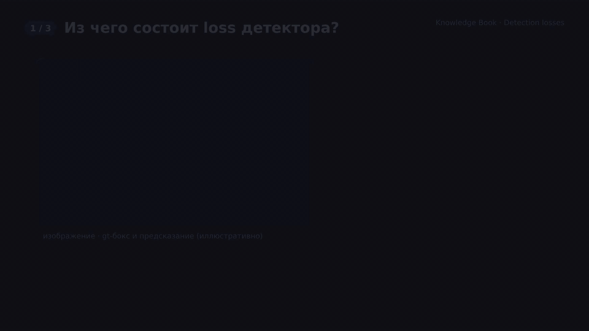

# Loss функции для детекции, сегментации и 3D‑детекции

## Оглавление

1. Обзор: как обычно устроена функция потерь в CV‑детекторах
2. Loss функции для 2D‑детекции объектов
   - классификационные loss’ы
   - loss’ы для регрессии боксов
   - вспомогательные loss’ы (objectness, centerness, heatmap‑loss)
3. Loss функции для сегментации (semantic, instance, panoptic)
4. Loss функции для 3D‑детекции
5. Focal Loss: формула и интуиция
6. Как бы я объяснил это 5‑летнему ребёнку
7. Источники

---

## 1. Обзор: как обычно устроена функция потерь в CV‑детекторах

В современных моделях детекции и сегментации функция потерь почти всегда **составная**:

- часть loss’а отвечает за **классификацию** (какой класс у объекта / пикселя / anchor’а);
- часть — за **регрессию геометрии** (координаты боксов, маски, 3D‑положение и ориентация);
- часто есть дополнительные термы (objectness, centerness, regularization).

Общий вид:

$$
\mathcal{L}_{total} = \lambda_{cls} \mathcal{L}_{cls} + \lambda_{reg} \mathcal{L}_{reg} + \lambda_{aux} \mathcal{L}_{aux},
$$

где коэффициенты $\lambda$ настраивают вклад каждой части.

---

## 2. Loss функции для 2D‑детекции объектов

### 2.1. Классификационные loss’ы

Для классификации anchor’ов, боксов или query‑токенов обычно используют:

- **Cross Entropy Loss**:
  - многоклассовая CE (softmax) или бинарная BCE (sigmoid по каждому классу);
  - стандарт в ранних детекторах (Faster R‑CNN, SSD и др.).

- **Focal Loss** (RetinaNet, CenterNet, FCOS и др.):
  - модификация CE, которая подавляет вклад лёгких примеров и усиливает сложные;
  - базовая формула (см. раздел 5):

    $$
    \mathcal{L}_{FL}(p) = -\alpha (1-p)^\gamma \log(p),
    $$

    где $p$ — вероятность правильного класса, $\alpha$ и $\gamma$ — гиперпараметры.

- **Variants: Quality Focal Loss, Varifocal Loss**:
  - учитывают не только «правильно/неправильно», но и качество предсказания (например, IoU бокса с gt);
  - используют в современных one‑stage детекторах (ATSS, YOLO‑варианты, GFL и др.).

### 2.2. Loss’ы для регрессии боксов

Классический подход:

- **L1 или Smooth L1 (Huber Loss)**:
  - Faster R‑CNN, SSD: регрессируют координаты (центр, ширину, высоту) бокса;
  - Smooth L1 менее чувствителен к выбросам, чем L2 (MSE), и, в отличие от чистого L1, гладкий около нуля.

IoU‑ориентированные loss’ы:

- **IoU Loss**:
  - оптимизирует непосредственно Intersection‑over‑Union между предсказанным и gt‑боксом;
  - хорошо коррелирует с метриками детекции.

- **GIoU / DIoU / CIoU Loss**:
  - GIoU (Generalized IoU) добавляет штраф за отсутствие перекрытия;
  - DIoU (Distance‑IoU) учитывает расстояние между центрами боксов;
  - CIoU (Complete‑IoU) также учитывает соотношение сторон;
  - используются в современных YOLO‑архитектурах и других one‑stage детекторах.

Часто детекторы комбинируют:

- L1/Smooth L1 по параметрам бокса + IoU‑подобный loss;
- или используют только IoU‑семейство для упрощения.

### 2.3. Вспомогательные loss’ы

- **Objectness / confidence loss**:
  - BCE или Focal Loss для предсказания, есть ли объект в ячейке/anchor’е.

- **Centerness loss** (FCOS и др.):
  - штрафует боксы, центр которых далеко от истинного центра объекта;
  - обычно BCE/Focal по скаляру centerness.

- **Heatmap loss** (CenterNet, CornerNet):
  - объект кодируется как «горячая точка» на heatmap;
  - используют модифицированный Focal Loss по каждому пикселю тепловой карты.

---

## 3. Loss функции для сегментации

В сегментации (semantic/instance/panoptic) основная цель — **пиксельная классификация** и, иногда, **предсказание масок** отдельных инстансов.

Популярные loss’ы:

- **Pixel‑wise Cross Entropy**:
  - стандарт для semantic segmentation;
  - для каждого пикселя считаем CE по softmax над классами.

- **Dice Loss (Soft Dice)**:
  - основан на коэффициенте Дайса (мере пересечения двух множеств);
  - особенно полезен при дисбалансе (маленькие объекты, орган в медицине и т.п.);

  $$
  \text{Dice} = \frac{2 |P \cap G|}{|P| + |G|}, \quad
  \mathcal{L}_{Dice} = 1 - \text{Dice}_{soft}.
  $$

- **Jaccard / IoU Loss**:
  - оптимизирует аналог IoU на уровне масок.

- **Tversky Loss, Focal Tversky Loss**:
  - обобщение Dice/Jaccard с разными весами для FN и FP;
  - Focal‑вариант усиливает влияние сложных примеров, аналогично Focal Loss.

- **Lovász‑Softmax Loss**:
  - дифференцируемая аппроксимация IoU на уровне классов;
  - полезен, когда целевая метрика — IoU или mIoU.

На практике часто используют **комбинации**:

- `TotalLoss = CE + λ * Dice`,
- или `Focal Loss + Dice/Tversky` для тяжело дисбалансных задач.

---

## 4. Loss функции для 3D‑детекции

3D‑детекторы (на LiDAR, стерео, камеры) предсказывают:

- наличие/класс объекта;
- 3D‑бокс (центр, размеры, ориентация);
- иногда BEV‑карты и heatmap’ы.

Типичные компоненты loss’а:

**1) Классификация**:

- те же идеи, что и в 2D:
  - CE / BCE;
  - Focal Loss (особенно при большом числе пустых voxels/anchors).

**2) Регрессия 3D‑боксов**:

- L1 / Smooth L1 по параметрам:
  - центр $(x, y, z)$;
  - размеры $(w, h, l)$;
  - угол поворота (yaw, иногда класс+регрессия угла).

- IoU‑подобные loss’ы для 3D:
  - 3D IoU Loss (пересечение объёмов);
  - BEV IoU Loss (IoU по проекции в плоскость $(x, y)$) — популярно в автомобилях.

- **Corner‑based loss**:
  - оптимизируется расстояние между углами предсказанного и истинного бокса.

**3) Heatmap‑loss для центр‑базированных методов** (например, CenterPoint, CenterNet3D):

- объекты кодируются как пики на BEV heatmap;
- используют Focal‑подобный loss по пикселям карты центра.

---

## 5. Focal Loss: формула и интуиция

Focal Loss — это модификация кросс‑энтропии, придуманная для задач с **сильным дисбалансом** между лёгкими негативами и сложными/редкими положительными примерами (RetinaNet и др.).

Пусть $p$ — предсказанная вероятность **правильного класса** (уже с учётом $y$), тогда:

$$
\mathcal{L}_{FL}(p) = - \alpha (1 - p)^\gamma \log(p),
$$

где:

- $\alpha \in (0, 1)$ — баланс между классами (позитив/негатив);
- $\gamma \ge 0$ — focusing parameter:
  - при $\gamma = 0$ получаем обычную CE (с весом $\alpha$);
  - при $\gamma > 0$:
    - **лёгкие примеры** с $p \approx 1$ дают почти нулевой вклад: $(1-p)^\gamma \approx 0$;
    - **сложные примеры** с малым $p$ сохраняют большой вклад в loss.

Идея: модель меньше «тратит силы» на примеры, которые уже хорошо классифицирует, и больше концентрируется на сложных случаях (маленькие объекты, частичное перекрытие, редкие классы).

Focal Loss используют:

- в head’ах детекторов (RetinaNet, FCOS, CenterNet, многие YOLO‑варианты);
- в сегментации и медицине (особенно в комбинации с Dice/Tversky при сильном дисбалансе);
- во всех задачах, где негативов в десятки/сотни раз больше, чем позитивов.

---

## 6. Как бы я объяснил это 5‑летнему ребёнку

- В задачах детекции и сегментации у нас много картинок и пикселей. Большинство из них — «ничего интересного» (фон), и только иногда есть машинка, человек или кошка.
- Обычный loss относится ко всем одинаково и может слишком сильно обращать внимание на простые задачи, которые мы уже умеем решать.
- **Focal Loss** — это как учитель, который говорит:  
  «На лёгкие примеры я буду смотреть мельком, а вот сложные, где вы часто ошибаетесь, будут для меня самыми важными».  
  Поэтому сеть учится лучше замечать редкие и сложные объекты.

**Визуализация (HyperFrames, 42 с):** сцена 1 — составной loss детектора (CE / Focal для класса + L1 / IoU для бокса), сцена 2 — почему IoU-loss даёт нулевой градиент, когда боксы не пересекаются, и как GIoU (охватывающий бокс C), DIoU (расстояние центров) и CIoU (соотношение сторон) это чинят, сцена 3 — Dice и Tversky для масок сегментации.

*Полная версия: [MP4 1080p](./assets/visualizations/detection-losses-iou-giou-dice.mp4) · сториборд и исходники сцен: [`visualizations/hyperframes/`](./visualizations/hyperframes/storyboard.md).*

---

## 7. Источники

- **Связанные документы в этом knowledge‑book**:
  - [`classification-losses-cross-entropy-focal-loss`](../classification-losses-cross-entropy-focal-loss/README.md) — подробный разбор кросс‑энтропии и Focal Loss в общем случае классификации.
  - [`non-maximum-suppression-nms`](../non-maximum-suppression-nms/README.md) — про пайплайны детекции и современные end‑to‑end детекторы, где используются описанные здесь loss’ы.
  - [`convolutions-and-parameters-in-cnn`](../convolutions-and-parameters-in-cnn/README.md) — архитектурная основа многих детекторов и сегментаторов.

