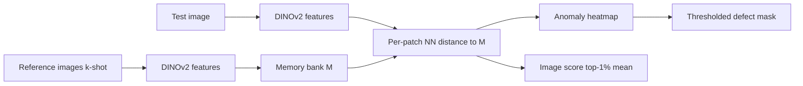

## Few-Shot Anomaly Detection: AnomalyDINO и patch-level nearest neighbors

## Table of Contents

1. [Краткий абстракт и объяснение для 5‑летнего ребёнка](#1-краткий-абстракт-и-объяснение-для-5летнего-ребёнка)
2. [Постановка задачи: industrial anomaly detection](#2-постановка-задачи-industrial-anomaly-detection)
3. [Идея AnomalyDINO в одном абзаце](#3-идея-anomalydino-в-одном-абзаце)
4. [Pipeline: memory bank, masking, сравнение](#4-pipeline-memory-bank-masking-сравнение)
5. [Как строится маска аномалии (pixel-level)](#5-как-строится-маска-аномалии-pixel-level)
6. [Метрики и бенчмарки](#6-метрики-и-бенчмарки)
7. [Применение: недолив / перелив кофе в стакане](#7-применение-недолив--перелив-кофе-в-стакане)
8. [Ограничения и failure cases](#8-ограничения-и-failure-cases)
9. [References](#references)

---

### 1. Краткий абстракт и объяснение для 5‑летнего ребёнка

**Кратко по‑взрослому.**  
**AnomalyDINO** ([Damm et al., WACV 2025](https://arxiv.org/abs/2405.14529)) — training-free метод few-shot anomaly detection: по **1–16 эталонным** «нормальным» изображениям строится банк патч-фич **DINOv2**, а на тесте каждый патч сравнивается с ближайшим «нормальным» соседом по **косинусному расстоянию**. Высокие расстояния → heatmap и **пиксельная маска дефекта**; агрегация top-1% патчей даёт **image-level score**. Без fine-tuning, без текста, ~60 ms на кадр (ViT-S, 448 px).

**Как объяснить 5‑летнему.**  
Покажи ребёнку идеальную картинку стакана с соком. Разрежь её на маленькие квадратики и запомни, «как пахнут» эти квадратики. Потом покажи другой стакан: если какой‑то квадратик **совсем не похож** на все запомненные — там, скорее всего, косяк (мало сока, пролили, пятно). AnomalyDINO так и делает, только «запах» — это числа из умной нейросети DINOv2.

---

### 2. Постановка задачи: industrial anomaly detection

- **Норма** $p_{\mathrm{norm}}(x)$: эталонные изображения без дефектов (царапина, трещина, не тот цвет, лишняя деталь).
- **Аномалия**: образец, сгенерированный «другим механизмом» — редкий дефект на линии.
- **Few-shot**: доступно $k \in \{1,2,4,8,16\}$ reference images, без большого train set.
- **Два выхода**:
  - **Detection** (image-level): бинарно «OK / defect»;
  - **Segmentation** (pixel-level): где именно дефект.

AnomalyDINO относится к **patch-level deep nearest neighbor** (родственники: PatchCore, SPADE), но с акцентом на **сильные self-supervised фичи DINOv2** и **zero-shot masking** без отдельной сегментационной модели.

---

### 3. Идея AnomalyDINO в одном абзаце

Экстрактор $f$ (DINOv2 ViT-S/14) режет изображение на патчи $14\times14$ px и выдаёт $f(\mathbf{x}) = (\mathbf{p}_1, \ldots, \mathbf{p}_n)$. Из $k$ эталонов (с аугментациями, напр. повороты) собирается **memory bank** $\mathcal{M}$. Для тестового патча $\mathbf{p}$ считается $d_{\mathrm{NN}}(\mathbf{p}; \mathcal{M}) = \min_{\mathbf{p}_{\mathrm{ref}} \in \mathcal{M}} d(\mathbf{p}, \mathbf{p}_{\mathrm{ref}})$ с $d$ = cosine distance. Image score — среднее по **1% патчей с наибольшим** $d_{\mathrm{NN}}$ (tail statistic, устойчивее max). Карта расстояний upsample + Gaussian blur → **anomaly map** → порог → маска.

---

### 4. Pipeline: memory bank, masking, сравнение

#### 4.1 Memory bank

$$ \mathcal{M} := \bigcup_{\mathbf{x}^{(i)} \in X_{\mathrm{ref}}} \bigl\{ \mathbf{p}_j^{(i)} \mid f(\mathbf{x}^{(i)}) = (\mathbf{p}_1^{(i)}, \ldots, \mathbf{p}_n^{(i)}),\; j \in [n] \bigr\} $$

- **Аугментации** (ротации) расширяют $\mathcal{M}$ в few-shot режиме (в full-shot наоборот часто **сжимают** bank coreset’ом).
- Backbone по умолчанию: **DINOv2 ViT-S**, разрешение **448** или **672** px (сторона кратна 14).

#### 4.2 Masking (объект vs фон)

- Первая **PCA-компонента** патч-фич DINOv2 → порог → маска объекта.
- **Masking test** один раз на категорию: если PCA-маска на эталоне явно ошибается — masking отключают.
- Морфология: dilation + closing, чтобы убрать дыры.
- Текстуры (wood, tile) обычно **не** маскируют.

#### 4.3 Сравнение на тесте

Косинусное расстояние:

$$ d(\mathbf{x}, \mathbf{y}) := 1 - \frac{\langle \mathbf{x}, \mathbf{y} \rangle}{\|\mathbf{x}\| \|\mathbf{y}\|} $$

Image-level score:

$$ s(\mathbf{x}_{\mathrm{test}}) := q\bigl(\{ d_{\mathrm{NN}}(\mathbf{p}_1; \mathcal{M}), \ldots, d_{\mathrm{NN}}(\mathbf{p}_n; \mathcal{M}) \}\bigr) $$

где $q$ = **mean of top 1%** distances (empirical tail at 99% quantile).

---

### 5. Как строится маска аномалии (pixel-level)

| Шаг | Действие |
|-----|----------|
| 1 | Для каждого патча $j$: $a_j = d_{\mathrm{NN}}(\mathbf{p}_j; \mathcal{M})$ |
| 2 | Решётка $a_j$ → **bilinear upsampling** до H×W |
| 3 | **Gaussian smoothing** ($\sigma = 4.0$) |
| 4 | Порог по val (F1-max / PRO на val) → бинарная **маска дефекта** |

Локализация сильнее растёт с **672 px**, т.к. эффективный патч мельче — важно для мелких дефектов.

Демонстрация агрегации и косинусного расстояния на синтетике: `scripts/01_patch_nn_anomaly_score.py`.

---

### 6. Метрики и бенчмарки

**Датасеты:** MVTec-AD (15 категорий, промышленные объекты/текстуры), VisA (12 категорий, сложнее сцены).

**Detection:** AUROC, F1-max, AP (image-level $s$).

**Segmentation:** AUROC, F1-max, **PRO** (per-region overlap) — на pixel scores; из‑за дисбаланса (~97% нормальных пикселей) одного seg-AUROC недостаточно.

**Пример (MVTec, 1-shot):** WinCLIP+ ~93.1% AUROC → AnomalyDINO-S (672) **96.6%**; inference ~**60 ms**/image (ViT-S, 448).

Код: [github.com/dammsi/AnomalyDINO](https://github.com/dammsi/AnomalyDINO).

---

### 7. Применение: недолив / перелив кофе в стакане

| Критерий | Оценка |
|----------|--------|
| Фиксированная камера, стабильный фон | ✅ Хорошо; masking отсекает конвейер |
| Нужен только OK / defect | ✅ Подходит как few-shot AD без разметки дефектов |
| Нужна **маска**, где уровень не тот | ✅ Heatmap в зоне жидкости / пустоты над нормой |
| Нужны **мл** или точная высота уровня | ⚠️ Нужен regression / классический CV (линия meniscus) поверх heatmap |
| Вариации пены, блики, разный сорт зёрен | ⚠️ Расширить $k$ эталонов (4–8), фиксировать освещение |
| Прозрачный стакан, уровень сбоку | ✅ Патчи в полосе жидкости отклонятся от $\mathcal{M}$ |
| Непрозрачный стакан | ⚠️ Камера **сверху**; иначе уровень не виден |

**Практический протокол**

1. Снять **4–8** кадров «нормального» наливa (разная пена в допустимых пределах).
2. Один раз проверить **masking test** на стакане.
3. На тесте: высокий $s$ + маска **ниже** эталонной зоны жидкости → недолив; **выше** → перелив (пост-правило по вертикали относительно ROI стакана).
4. Калибровать порог на валидации; метрики — как в industrial AD (AUROC/F1), плюс бизнес-метрика «ложные остановки линии».

AnomalyDINO здесь — сильный **baseline без обучения**; для продакшена с жёстким SLA по миллилитрам обычно комбинируют с геометрией (детекция meniscus / регрессия уровня).

---

### 8. Ограничения и failure cases

- **Семантические** аномалии (не тот SKU, перепутанный продукт) — слабее, чем **низкоуровневые** дефекты (царапины, пятна).
- **PCA masking** ломается на close-up, когда объект > ~50% кадра.
- **Вращение как аномалия** (неправильно вкрученный винт) — дефолтные ротации в bank могут **скрыть** дефект; нужен informed preprocessing.
- **Batched zero-shot** слабее специализированных методов (MuSc); для few-shot AnomalyDINO — сильный выбор.
- **Covariate shift** освещения/камеры — нужно обновлять эталоны $\mathcal{M}$.

---

## References

- Paper: [AnomalyDINO: Boosting Patch-based Few-shot Anomaly Detection with DINOv2](https://arxiv.org/abs/2405.14529) (arXiv:2405.14529, WACV 2025 Oral)
- Code: [dammsi/AnomalyDINO](https://github.com/dammsi/AnomalyDINO)
- Related in knowledge-book:
  - [DINOv3: Self-Supervised Vision Transformer и 2D RoPE](../dinov3-self-supervised-vision-transformer-and-2d-rope/README.md) — родственный self-supervised ViT-бэкбон и патч-фичи
  - [Transformers, Attention and Vision Transformers (ViT)](../transformers-attention-and-vision-transformers-vit/README.md)
  - [SOTA Metrics for Detection, Segmentation, and Multiclass Classification](../sota-metrics-for-detection-segmentation-multiclass-classification/README.md) — mIoU, Mask AP, PRO
  - [ROC Curves and ROC AUC](../roc-curve-and-roc-auc/README.md) — пороги и AUROC для detection
  - [Contrastive & Metric Learning for Fine-Grained Visual Recognition](../contrastive-and-metric-learning-for-fine-grained-visual-recognition/README.md) — близкие идеи embedding + distance
