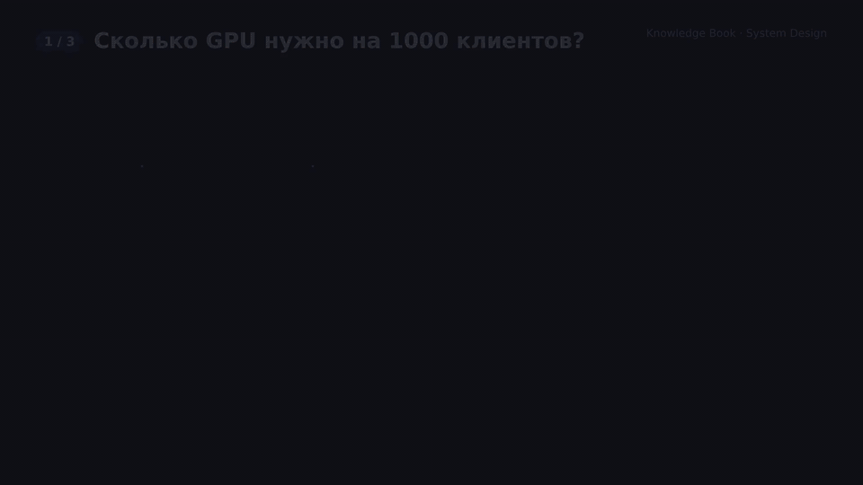

# System Design для Computer Vision и NLP

## Как объяснить 5-летнему ребёнку

Представь очередь за мороженым. Один продавец успевает обслужить двоих детей в минуту. Если пришли трое друзей — они подождут чуть-чуть. Если приехала целая экскурсия из ста детей, очередь станет длиной в улицу, мороженое растает, дети уйдут. Можно поставить ещё десять окошек и человека, который говорит «ты — к окошку три». А если это не мороженое, а камеры в магазине, нельзя копить старые кадры: нужна только **последняя** картинка «кто сейчас у полки», иначе охранник смотрит в прошлое.

System Design — это умение заранее посчитать, сколько окошек нужно, куда ставить очередь и что выбрасывать, чтобы система не «таяла» под нагрузкой.

## Оглавление

1. [Что такое System Design](#что-такое-system-design)
2. [Карта знаний для CV и NLP](#карта-знаний-для-cv-и-nlp)
3. [Фундамент: что измерять до квадратиков на доске](#фундамент-что-измерять-до-квадратиков-на-доске)
4. [Балансировка нагрузки](#балансировка-нагрузки)
5. [Как сервить модель на 100 и на 1000 клиентов](#как-сервить-модель-на-100-и-на-1000-клиентов)
6. [Потоки с 10 и 50 камер](#потоки-с-10-и-50-камер)
7. [Типичные вопросы](#типичные-вопросы)
8. [Примеры кода](#примеры-кода)
9. [Источники](#источники)

---

## Что такое System Design

**System Design** — это проектирование системы под явные ограничения: сколько пользователей, какой отклик, какая цена, какая надёжность, что происходит при отказе.

Это не «нарисовать микросервисы». Это ответы на вопросы:

- какую **нагрузку** мы обещаем выдержать (RPS, одновременные сессии, кадры/с);
- какой **SLO** нельзя нарушать (например p99 латентности $< 200$ мс);
- где **узкое место**: CPU, GPU, диск, сеть, декод видео, база, сам forward модели;
- как система **деградирует**: очередь, дроп, fallback на меньшую модель, «только алерты, без трекинга».

В ML отдельный сюрприз: модель — это один ящик. Вокруг неё живут очереди, батчеры, кэши, балансировщики, мониторинг дрейфа и канарейки версий. Именно обвязка решает, поедет ли YOLO / LLM в проде или останется красивым ноутбуком.

Два разных мира, которые часто путают:

| | Обучение | Serving (инференс) |
|---|---|---|
| Цель | качество на валидации | SLO + стоимость + свежесть |
| Batch | большой, статичный | маленький / динамический |
| Допустимая задержка | часы–дни | миллисекунды–секунды |
| Главный враг | переобучение | очередь, GPU-простой, OOM |
| Масштаб | датасет × эпохи | клиенты × RPS × размер входа |

---

## Карта знаний для CV и NLP

Ниже — то, без чего «я обучил модель» не превращается в работающий продукт. Классический CS и ML-специфика нужны **вместе**.

### Общий фундамент (любой backend + ML)

- Сеть: латентность vs пропускная способность, HTTP/gRPC, keep-alive, TLS.
- Процессы и параллелизм: процессы vs потоки, GIL, CUDA context, shared memory.
- Очереди и backpressure: Kafka / Redis / in-process queue, drop vs block.
- Кэш: CDN, результат по ключу, эмбеддинги, KV-кэш LLM (см. [Transformers и KV cache](../transformers-attention-and-vision-transformers-vit/README.md)).
- Данные: индексы, векторный поиск, feature store; согласованность «достаточно свежо».
- Надёжность: таймауты, ретраи с jitter, идемпотентность, circuit breaker, дедлайн.
- Наблюдаемость: RPS, p50/p95/p99, GPU util, queue depth, error budget.
- Деплой: blue/green, canary, A/B, откат модели.

### Computer Vision

- Декод видео часто **дороже**, чем сам детектор: детали кодеков и NVDEC — в [H.264/H.265 и GPU-decode](../video-codecs-h264-h265-and-gpu-decode/README.md).
- Разрешение × FPS × число камер = входящий поток; модель почти никогда не должна есть все кадры.
- Трекер дешевле детектора: детектируем реже, трекаем чаще ([UKF / ByteTrack](../unscented-kalman-filter-and-tracking/README.md)).
- NMS и постобработка влияют на **хвост** латентности ([NMS в production](../non-maximum-suppression-nms/README.md)).
- Идентификация: ANN-индекс (FAISS/HNSW) и пороги open-set ([ArcFace](../arcface-and-angular-margin-losses-for-identification/README.md), [эмбеддинги](../embeddings-and-embedding-matrix/README.md)).

### NLP / LLM

- Два разных этапа: **prefill** (прочитать промпт) и **decode** (токен за токеном).
- Память KV-кэша растёт как $\text{слои} \times \text{головы} \times \text{длина} \times \text{batch}$; 100 «клиентов» с длинным контекстом могут забить один H100 сильнее, чем 1000 коротких классификаций.
- Continuous batching / paged attention (vLLM, TensorRT-LLM): пока один клиент генерирует токен, слот GPU отдаётся другому.
- RAG: латентность = retrieval + rerank + generate; кэшировать чанки и эмбеддинги запроса ([RAG](../retrieval-augmented-generation-rag/README.md)).
- Токенизация меняет стоимость: более «болтливый» токенизатор = больше шагов decode ([токенизация](../tokenization-and-text-compression-in-llms/README.md)).

---

## Фундамент: что измерять до квадратиков на доске

### Latency и throughput

- **Latency** — время одного запроса (лучше смотреть p50 / p95 / p99, не среднее).
- **Throughput** — сколько запросов/токенов/кадров в секунду система **завершает**.

Они спорят друг с другом. Большая пачка на GPU поднимает throughput и часто **увеличивает** латентность каждого, кто ждал, пока пачка наберётся. Serving — это поиск точки на этой кривой под SLO.

### SLO, SLA, SLI

- **SLI** — что меряем: p99 latency, доля 5xx, freshness кадра.
- **SLO** — цель: «p99 $< 200$ мс в 99.9% минут».
- **SLA** — юридический/продуктовый договор, если он есть.

Без SLO нельзя выбрать между «одна большая модель» и «маленькая + эскалация».

### Утилизация и закон Литтла

Пусть $\lambda$ — интенсивность приходов (запросов в секунду), $\mu$ — скорость одного воркера, $n$ — число воркеров. Утилизация:

$$\rho = \frac{\lambda}{n\mu}$$

Если $\rho \ge 1$, очередь растёт без Bound: никакой «оптимизации кода» это не спасёт, нужны ещё реплики, меньше работы на запрос или отказ в обслуживании.

**Закон Литтла**: среднее число запросов в системе

$$L = \lambda W,$$

где $W$ — среднее время пребывания (очередь + сервис). Интуиция: если 40 запросов/с живут в системе по 55 мс, внутри в среднем $40 \times 0.055 \approx 2.2$ запроса. Это уже видно в скрипте `01_capacity_planning.py`.

Следствие: чтобы удержать $W$, при росте $\lambda$ нужно либо ускорить сервис ($\mu$), либо добавить воркеры ($n$), либо **не принимать** лишнее (rate limit / drop).

### Очередь, таймаут, backpressure

Три честные политики, когда GPU не успевает:

1. **Блокировать клиента** (TCP backpressure) — просто, но каскадно роняет вызывающую систему.
2. **Ограниченная очередь + 429/timeout** — клиент знает, что надо ретраить/упростить запрос.
3. **Drop-oldest** (для видео) — лучше выбросить старый кадр, чем обработать прошлое.

Никогда не стройте безлимитный FIFO «на всякий случай»: он превращает перегрузку в минуты устаревших результатов.

---

## Балансировка нагрузки

**Балансировщик** распределяет входящие запросы по нескольким репликам модели, чтобы ни одна не умерла от $\rho \to 1$, пока сосед простаивает.

Что важно именно для ML, а не для раздачи картинок:

| Стратегия | Когда уместна | Риск для ML |
|---|---|---|
| Round-robin | Похожие короткие запросы (классификация, детекция фиксированного размера) | Длинный LLM-запрос рядом с коротким — «несправедливая» очередь |
| Least connections | Разный размер работы | Не знает про KV-кэш и длину промпта |
| Least outstanding tokens / queue time | LLM | Нужен умный scheduler (vLLM, Triton) |
| Consistent hashing | Кэш на реплике: префикс промпта, эмбеддинг пользователя, «горячая» камера | Решардинг при добавлении GPU сбрасывает кэш |
| Sticky session | Мультикамера + трекер со **состоянием** на воркере | Плохо при рестарте; состояние лучше вынести |

Уровни:

- **L4** (TCP) — дёшево, не видит HTTP-путь `/detect` vs `/generate`.
- **L7** (HTTP/gRPC) — можно рутить «лёгкие» эмбеддинги на CPU, а generate — на GPU.
- **Application scheduler** — Triton, vLLM, Ray Serve: батчинг, приоритизация, continuous batch.

Правило: балансировщик без **общей картины очереди GPU** — это только первый слой. Второй слой — батчер/планировщик **внутри** ноды.

Отказоустойчивость: health check должен смотреть не «процесс жив», а «GPU отвечает за SLO». Иначе балансировщик будет слать трафик в процесс, который уже пять минут ждёт CUDA sync.

---

## Как сервить модель на 100 и на 1000 клиентов

Число клиентов — **плохая** единица планирования. Нужны:

- средняя и пиковая частота запросов на клиента;
- размер входа (токены, разрешение, число кропов);
- сколько запросов **одновременно in-flight**;
- SLO на p99.

### Считаем на пальцах

Допустим, один GPU классификатора/детектора делает $\mu = 50$ запросов/с при целевом batch.

- 100 клиентов × $0.4$ запроса/с $\Rightarrow \lambda = 40$/с, $\rho = 0.8$ — **один GPU с запасом**.
- 1000 клиентов × $0.4$/с $\Rightarrow \lambda = 400$/с, $\rho = 8$ — **один GPU физически не успевает**. Нужно порядка $400/50 \approx 8$ GPU плюс запас на пик (часто $\times 1.3$–$2$).

Симуляция в `01_capacity_planning.py` (пуассоновские приходы, таймаут 500 мс):

| Сценарий | $\rho$ | drop rate | p99 latency |
|---|---|---|---|
| 100 клиентов, 1 GPU | 0.80 | 0 | ~165 мс |
| 1000 клиентов, 1 GPU | 8.00 | ~0.87 | упирается в таймаут |
| 1000 клиентов, 10 GPU | 0.80 | 0 | ~39 мс |

Вывод, который ждут на интервью: **сначала закон очередей, потом фреймворк**. 1000 клиентов на той же модели — это не «поставь FastAPI», это горизонтальные реплики + балансировщик + автоскейл по глубине очереди / GPU util, не по CPU.

### Dynamic batching

GPU любит пачки: фиксированный overhead кернела плюс почти линейный член

$$T(B) = T_0 + t_{\text{item}} \cdot B.$$

Пропускная способность $B / T(B)$ растёт с $B$, пока влезает память. В `02_dynamic_batching.py` при $\lambda = 250$/с:

- без пачки: $\approx 100$ items/s и ~59% таймаутов (GPU занят overhead'ом);
- с dynamic batching (max $B=8$, ждать до 8 мс): $\approx 250$ items/s и 0 дропов.

Это ровно то, что делают Triton Inference Server, TensorRT и batched ONNX Runtime: **подождать чуть-чуть**, чтобы заполнить SM'ы.

**Визуализация (HyperFrames, ~44 с):** закон очередей на пальцах — $\mu = 50$/с, 100 vs 1000 клиентов, $\rho = 0.8$ против $\rho = 8$ и таблица симуляции (сцена 1); балансировщик и 10 реплик, автоскейл по глубине очереди и GPU util (сцена 2); dynamic batching — $T(B) = T_0 + t_{\text{item}} B$, $\approx 100$ vs $\approx 250$ items/s при $\lambda = 250$/с (сцена 3).



*Полная версия: [MP4 1080p](./assets/visualizations/serving-load-balancer-batching.mp4) · сториборд и исходники сцен: [`visualizations/hyperframes/`](./visualizations/hyperframes/storyboard.md).*

### 100 vs 1000 для LLM — другая арифметика

Для авторегрессии узкое место часто **память KV-кэша**, не «запросов в секунду».

Грубая оценка (зависит от GQA/MQA, квантизации, paged attention):

$$\text{KV} \approx 2 \cdot n_{\text{layers}} \cdot n_{\text{kv heads}} \cdot d_{\text{head}} \cdot L \cdot B \cdot \text{bytes}.$$

Если одна сессия с $L = 8\text{k}$ уже занимает сотни мегабайт, то «100 одновременных чатов» = упереться в VRAM. «1000 клиентов» тогда значат:

- не держать 1000 кэшей сразу: очередь + максимум concurrent slots;
- continuous batching: слоты заняты только пока идёт decode;
- prefix / prompt cache для одинаковых системных промптов;
- иногда **разнести prefill и decode** на разные пулы GPU (disaggregated serving).

Классификатор на 1000 RPS и чат-бот на 1000 DAU — разные системы, хотя оба «NLP».

### Практический скелет serving

1. Stateless реплики модели за балансировщиком.
2. Внутри реплики — очередь с лимитом + dynamic / continuous batching.
3. Отдельный пул для «дешёвых» моделей (эмбеддинги, классификатор) и «дорогих» (LLM, сегментация).
4. Кэш: одинаковый кроп / одинаковый промпт не должен повторно жечь GPU.
5. Canary 5–10% трафика на новую версию; откат по p99 и калибровке, не только по accuracy ([калибровка](../how-models-predict-confidence-and-calibration/README.md)).
6. Автоскейл по **queue depth** и GPU SM util, не по среднему CPU.

Стек, который реально встречается: NVIDIA Triton, vLLM / TensorRT-LLM, TorchServe, ONNX Runtime, Ray Serve, BentoML, TensorRT, OpenVINO / TensorRT на edge. Разбор Triton, ответ «нужен ли на 1 GPU» и карта SOTA serving — в [Triton и GPU model serving](../triton-inference-server-and-gpu-model-serving/README.md).

---

## Потоки с 10 и 50 камер

Задача: детекция + трекинг с $N$ камер. Входящий поток

$$\lambda_{\text{frames}} = N \cdot \text{FPS}_{\text{cam}}.$$

При 30 FPS: 10 камер = 300 кадр/с, 50 камер = 1500 кадр/с. Детектор на одном GPU часто даёт 50–200 кадр/с, не 1500. Значит **нельзя** гнать каждый кадр через сеть.

### Где обычно узкое место

Порядок, в котором стоит профилировать:

1. **Декод** (H.264/H.265) на CPU — классическая ловушка. NVDEC / VAAPI снимает это с CPU ([топик про кодеки](../video-codecs-h264-h265-and-gpu-decode/README.md)).
2. **Копии CPU↔GPU** и лишние `resize` на полном 4K.
3. Forward модели.
4. Постобработка / NMS на CPU в одном потоке.
5. Запись всех боксов в БД синхронно в горячем пути.

### Наивная vs эффективная схема

**Наивно:** процесс на камеру + общий FIFO всех кадров. GPU ест самые старые. При перегрузке вы смотрите, что было секунду назад. В симуляции `03_multicamera_pipeline.py` на 50 камерах FIFO даёт **~1 с** средней устарелости.

**Эффективно:**

1. Один ingest (GStreamer/FFmpeg/DeepStream): $N$ RTSP, аппаратный декод.
2. На камеру слот «только последний кадр» (**drop-oldest**). Живое видео не имеет права копить историю в очереди инференса.
3. GPU забирает **пачку с разных камер** (как dynamic batching, только ключ — `camera_id`).
4. Детектор реже, чем FPS камеры: 5–10 Hz часто достаточно, трекер дотягивает промежутки.
5. Motion / ROI: пустые камеры не занимают batch.
6. Состояние трекера — per-camera, CPU, sticky к воркеру или во внешней памяти.

Та же симуляция:

| | 10 камер, FIFO | 10 камер, latest+batch | 50 камер, FIFO | 50 камер, latest+batch |
|---|---|---|---|---|
| Обработано, кадр/с | ~205 | ~300 | ~205 | ~518 |
| Средняя устарелость | ~463 мс | ~20 мс | ~1009 мс | ~34 мс |
| Drop | ~32% | ~0% | ~86% | ~66% |

Drop на 50 камерах в «умной» схеме — это **намеренно выброшенные промежуточные кадры**, а не «система умерла». Устарелость остаётся десятки миллисекунд: вы всегда смотрите почти «сейчас». FIFO при том же GPU смотрит в прошлое.

Для 50 камер на одном среднем детекторе дальше выбирают одно или несколько:

- вторая (третья) GPU-реплика + балансировка **по camera_id** (sticky, чтобы трекер не прыгал);
- меньшая модель / меньшее разрешение / каждый $k$-й кадр;
- edge у камеры: на сервер уходят кропы и события, не 4K 30 FPS.

### Типовая архитектура

```text
RTSP × N → decode (NVDEC) → per-camera latest frame
        → GPU batch detector → NMS
        → per-camera tracker (ByteTrack/UKF)
        → бизнес-логика / алерты / индекс лиц
```

Идентификация лица/SKU после детекции — отдельный сервис эмбеддингов с ANN, его тоже батчат. Не смешивайте в одном синхронном вызове «детектор 50 камер + ArcFace 200 кропов»: развяжите очередями.

---

## Типичные вопросы

Их задают и на интервью, и в дизайне реальной системы. Короткие направления ответа:

1. **Как сервить детектор на 100 RPS? на 10k RPS?** — Посчитать $\rho$, dynamic batching, реплики, отдельный CPU-пул для decode/NMS.
2. **p99 внезапно вырос, GPU util 40%.** — Маленький batch, CPU bottleneck, lock, page faults, NMS, логирование, GIL, синхронный I/O.
3. **LLM, 500 одновременных чатов.** — KV-память, max concurrent slots, continuous batching, квантизация, ограничение $L$.
4. **50 камер, «тормозит».** — Не модель, а FIFO+decode; latest-frame, NVDEC, skip, sticky tracker.
5. **Как обновлять модель без простоя?** — Canary, теневой трафик, сравнение калибровки и p99, мгновенный rollback.
6. **Где кэшировать?** — Идентичные кадры/промпты, эмбеддинги документов RAG, префиксы system prompt.
7. **Как не потерять трек при рестарте воркера?** — Состояние трекера вне процесса или checkpoint; балансировка по `camera_id`.
8. **Стоимость.** — доллары за 1k запросов или за камера·час; часто выгоднее меньшая модель + эскалация, чем всегда гигант.

---

## Примеры кода

Все скрипты — детерминированные симуляции без реальной нейросети: они проверяют **системные** инварианты (очередь, пачка, свежесть кадра).

```bash
uv run python topics/ml-system-design-for-cv-and-nlp/scripts/01_capacity_planning.py
uv run python topics/ml-system-design-for-cv-and-nlp/scripts/02_dynamic_batching.py
uv run python topics/ml-system-design-for-cv-and-nlp/scripts/03_multicamera_pipeline.py
```

1. `scripts/01_capacity_planning.py` — 100 vs 1000 клиентов, закон Литтла, зачем горизонтальный масштаб.
2. `scripts/02_dynamic_batching.py` — $T(B)=T_0 + t B$, рост throughput и падение таймаутов.
3. `scripts/03_multicamera_pipeline.py` — FIFO vs latest-frame + batch на 10 и 50 камерах.

---

## Источники

### Связанные темы в книге

- [Transformers, Attention и ViT](../transformers-attention-and-vision-transformers-vit/README.md) — KV-кэш как главный рычаг serving LLM.
- [NMS и end-to-end детекторы](../non-maximum-suppression-nms/README.md) — хвост латентности и предсказуемый инференс.
- [UKF и трекинг](../unscented-kalman-filter-and-tracking/README.md) — дешёвое состояние между редкими детекциями.
- [RAG](../retrieval-augmented-generation-rag/README.md) — retrieval как отдельный бюджет латентности.
- [Эмбеддинги](../embeddings-and-embedding-matrix/README.md) — ANN-индекс как часть serving, не «просто матрица».
- [Калибровка уверенности](../how-models-predict-confidence-and-calibration/README.md) — пороги и мониторинг в проде.
- [Настройка гиперпараметров](../hyperparameter-tuning/README.md) — соседний MLOps-слой: обучение, не serving.
- [Видеокодеки H.264/H.265 и GPU-decode](../video-codecs-h264-h265-and-gpu-decode/README.md) — почему ingest камер упирается в декод, а не в YOLO.
- [MCP, ACP, UCP и Agent Harness](../agent-protocols-mcp-acp-ucp-and-harness/README.md) — протоколы и обвязка агента: соседний слой надёжности, не serving GPU.
- [Triton и GPU model serving](../triton-inference-server-and-gpu-model-serving/README.md) — runtime: Triton, vLLM, TensorRT-LLM; 1 GPU и 100× пользователей.

### Внешние материалы

- Kleinrock, L. *Queueing Systems* — закон Литтла и $\rho < 1$.
- NVIDIA Triton Inference Server — dynamic batching, model ensembles (подробнее в топике выше).
- Kwon et al., *Efficient Memory Management for Large Language Model Serving with PagedAttention* (vLLM), 2023.
- NVIDIA DeepStream / GStreamer — мультикамерный ingest и NVDEC.
- High Scalability / «Designing data-intensive applications» (Kleppmann) — очереди, репликация, кэш; модель — ещё один stateful/stateless сервис.
