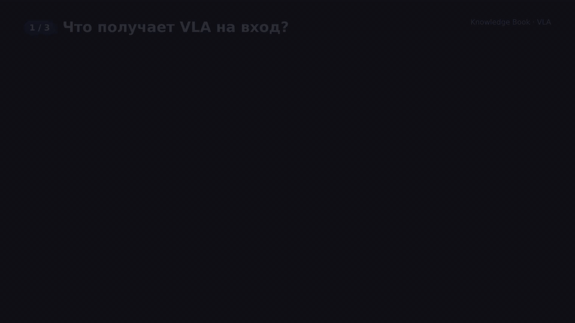

# Модели Vision-Language-Action (VLA)

## Оглавление

1. [Введение: что такое VLA модели и зачем они нужны](#1-введение-что-такое-vla-модели-и-зачем-они-нужны)
2. [Архитектура VLA: как объединяются Vision, Language и Action](#2-архитектура-vla-как-объединяются-vision-language-и-action)
3. [Ключевые компоненты: энкодеры, проекторы, декодеры действий](#3-ключевые-компоненты-энкодеры-проекторы-декодеры-действий)
4. [Обучение VLA моделей: данные, loss функции, fine-tuning](#4-обучение-vla-моделей-данные-loss-функции-fine-tuning)
5. [Современные VLA модели: RT-1, RT-2, OpenVLA, F1-VLA, Octo, SmolVLA](#5-современные-vla-модели-rt-1-rt-2-openvla-f1-vla-octo-smolvla)
6. [Применения: манипуляция, навигация, автономные системы](#6-применения-манипуляция-навигация-автономные-системы)
7. [Сравнение с другими подходами: RL, Imitation Learning](#7-сравнение-с-другими-подходами-rl-imitation-learning)
8. [Реализация: примеры кода и использование](#8-реализация-примеры-кода-и-использование)
9. [Связанные темы и источники](#9-связанные-темы-и-источники)
10. [Как объяснить это 5-летнему ребёнку](#10-как-объяснить-это-5-летнему-ребёнку)

---

## 1. Введение: что такое VLA модели и зачем они нужны

**VLA (Vision-Language-Action)** модели — это новый класс AI систем, которые объединяют:
- **Vision**: визуальное восприятие (изображения с камер робота)
- **Language**: понимание естественного языка (инструкции, команды)
- **Action**: генерация действий (управление роботом)

**Проблема, которую решают VLA:**
- Традиционные роботы требуют программирования для каждой задачи
- RL требует много времени и данных для обучения
- Нужен способ быстро адаптировать роботов к новым задачам через естественный язык

**Решение VLA:**
- Робот получает **текстовую инструкцию** ("подними красный кубик")
- **Видит** окружающую среду через камеры
- **Генерирует действия** напрямую из vision + language представлений
- Может быть **fine-tuned** на новые задачи с минимальными данными

**История:**
- **2021-2022**: Первые попытки объединить vision-language для роботов
- **2022-2023**: RT-1 (декабрь 2022), RT-2 (2023) от Google — прорыв в масштабировании
- **2024**: OpenVLA, Octo, π0 — open-source альтернативы
- **2025-2026**: SmolVLA, F1-VLA, π0.5 и др.; массовое распространение, fine-tuning на consumer GPU

---

## 2. Архитектура VLA: как объединяются Vision, Language и Action

### 2.1. Общая архитектура

**Типичная VLA архитектура:**

```text
[Изображения] → [Vision Encoder] ─┐
                                   ├→ [Fusion Layer] → [Action Decoder] → [Действия робота]
[Текстовая инструкция] → [Language Encoder] ─┘
```

**Компоненты:**

1. **Vision Encoder**: 
   - Извлекает визуальные признаки из изображений камер
   - Обычно: ViT (Vision Transformer), ResNet, или комбинация (SigLIP + DINOv2)

2. **Language Encoder**:
   - Кодирует текстовые инструкции
   - Обычно: LLM (LLaMA, GPT) или encoder-only модель (BERT)

3. **Fusion Layer**:
   - Объединяет vision и language представления
   - Transformer-based cross-attention между vision и language токенами

4. **Action Decoder**:
   - Генерирует действия робота (позиции, скорости, захват)
   - Может быть: MLP head, Transformer decoder, или diffusion model

### 2.2. Математическая формулировка

**Входы:**
- Изображения: $I \in \mathbb{R}^{H \times W \times 3}$ (или последовательность изображений)
- Инструкция: $T = \{t_1, t_2, ..., t_n\}$ (токены текста)

**Выход:**
- Действия: $\mathbf{a} \in \mathbb{R}^{d_a}$, где $d_a$ — размерность пространства действий

**Процесс:**

1. **Vision encoding:**
   $$
   \mathbf{v} = \text{VisionEncoder}(I) \in \mathbb{R}^{N_v \times d_v}
   $$
   где $N_v$ — количество vision токенов (патчей), $d_v$ — размерность признаков

2. **Language encoding:**
   $$
   \mathbf{l} = \text{LanguageEncoder}(T) \in \mathbb{R}^{N_l \times d_l}
   $$
   где $N_l$ — количество language токенов, $d_l$ — размерность признаков

3. **Fusion (cross-attention):**
   $$
   \mathbf{h} = \text{CrossAttention}(\mathbf{v}, \mathbf{l}) \in \mathbb{R}^{N_v \times d}
   $$
   
   Детально:
   $$
   \text{Attention}(Q, K, V) = \text{softmax}\left(\frac{QK^T}{\sqrt{d_k}}\right)V
   $$
   
   где:
   - $Q = \mathbf{v} W_Q$ (queries из vision)
   - $K = \mathbf{l} W_K$ (keys из language)
   - $V = \mathbf{l} W_V$ (values из language)

4. **Action generation:**
   $$
   \mathbf{a} = \text{ActionDecoder}(\mathbf{h}) \in \mathbb{R}^{d_a}
   $$

### 2.3. Типы архитектур

**1. Autoregressive VLA:**
- Генерируют действия как дискретные токены последовательно (как языковые модели)
- Пример: RT-1, RT-2, OpenVLA
- Формула: $p(\mathbf{a}_t \mid I, T, \mathbf{a}_{\lt t})$

**2. Diffusion-based VLA:**
- Используют diffusion models для генерации действий
- Пример: Octo, Diffusion Policy
- Более плавные и естественные движения

**3. Hybrid (VLM-бэкбон + отдельный action expert):**
- Предобученная VLM для восприятия и языка + отдельный модуль (flow matching / diffusion), генерирующий chunk непрерывных действий
- Пример: π0, SmolVLA, F1-VLA

---

## 3. Ключевые компоненты: энкодеры, проекторы, декодеры действий

### 3.1. Vision Encoders

**Варианты:**

**1. Vision Transformer (ViT):**
```python
class ViTVisionEncoder(nn.Module):
    def __init__(self, img_size=224, patch_size=16, embed_dim=768):
        super().__init__()
        self.patch_embed = PatchEmbedding(img_size, patch_size, embed_dim)
        self.transformer = TransformerEncoder(num_layers=12, embed_dim=embed_dim)
        
    def forward(self, x):
        # x: [B, 3, H, W]
        patches = self.patch_embed(x)  # [B, N_patches, embed_dim]
        features = self.transformer(patches)  # [B, N_patches, embed_dim]
        return features
```

**2. SigLIP + DINOv2 (как в OpenVLA):**
- **SigLIP**: Vision-language модель для понимания изображений
- **DINOv2**: Self-supervised модель для детальных признаков
- Комбинация даёт лучшее понимание сцены

**3. ResNet-based:**
- Классические CNN энкодеры
- Быстрее, но менее гибкие

### 3.2. Language Encoders

**Варианты:**

**1. LLM-based (LLaMA, GPT):**
```python
from transformers import LlamaForCausalLM

class LLMLanguageEncoder(nn.Module):
    def __init__(self, model_name="meta-llama/Llama-2-7b-hf"):
        super().__init__()
        self.llm = LlamaForCausalLM.from_pretrained(model_name)
        # Замораживаем или fine-tune последние слои
        
    def forward(self, text_tokens):
        # text_tokens: [B, seq_len]
        outputs = self.llm.model(text_tokens)  # Скрытые состояния decoder-only LLM без LM head
        return outputs.last_hidden_state  # [B, seq_len, hidden_dim]
```

**2. Encoder-only (BERT):**
- Быстрее, но менее выразительные
- Хорошо для простых инструкций

### 3.3. Fusion Layers

**Cross-Attention Fusion:**

```python
class CrossAttentionFusion(nn.Module):
    def __init__(self, vision_dim, language_dim, hidden_dim):
        super().__init__()
        self.vision_proj = nn.Linear(vision_dim, hidden_dim)
        self.language_proj = nn.Linear(language_dim, hidden_dim)
        self.cross_attn = nn.MultiheadAttention(hidden_dim, num_heads=8)
        
    def forward(self, vision_features, language_features):
        # vision_features: [B, N_v, vision_dim]
        # language_features: [B, N_l, language_dim]
        
        v_proj = self.vision_proj(vision_features)  # [B, N_v, hidden_dim]
        l_proj = self.language_proj(language_features)  # [B, N_l, hidden_dim]
        
        # Cross-attention: vision queries, language keys/values
        fused, _ = self.cross_attn(
            query=v_proj,
            key=l_proj,
            value=l_proj
        )  # [B, N_v, hidden_dim]
        
        return fused
```

**Transformer Fusion:**

```python
class TransformerFusion(nn.Module):
    def __init__(self, hidden_dim, num_layers=6):
        super().__init__()
        # Конкатенация vision + language токенов
        self.transformer = nn.TransformerEncoder(
            nn.TransformerEncoderLayer(hidden_dim, nhead=8),
            num_layers=num_layers
        )
        
    def forward(self, vision_features, language_features):
        # Конкатенируем: [CLS] + vision + language
        combined = torch.cat([
            language_features[:, 0:1],  # CLS token
            vision_features,
            language_features[:, 1:]  # остальные language токены
        ], dim=1)
        
        fused = self.transformer(combined)
        return fused
```

### 3.4. Action Decoders

**1. MLP Head (простой):**

```python
class MLPActionDecoder(nn.Module):
    def __init__(self, hidden_dim, action_dim):
        super().__init__()
        self.decoder = nn.Sequential(
            nn.Linear(hidden_dim, 512),
            nn.ReLU(),
            nn.Linear(512, 256),
            nn.ReLU(),
            nn.Linear(256, action_dim)
        )
        
    def forward(self, fused_features):
        # fused_features: [B, N, hidden_dim]
        # Берём среднее по токенам или CLS токен
        pooled = fused_features.mean(dim=1)  # [B, hidden_dim]
        actions = self.decoder(pooled)  # [B, action_dim]
        return actions
```

**2. Transformer Decoder (autoregressive):**

```python
class TransformerActionDecoder(nn.Module):
    def __init__(self, hidden_dim, action_dim, max_seq_len=10):
        super().__init__()
        self.action_embed = nn.Linear(action_dim, hidden_dim)
        self.decoder = nn.TransformerDecoder(
            nn.TransformerDecoderLayer(hidden_dim, nhead=8),
            num_layers=6
        )
        self.output_head = nn.Linear(hidden_dim, action_dim)
        
    def forward(self, fused_features, previous_actions=None):
        # Autoregressive генерация действий
        if previous_actions is None:
            # Первый шаг
            action_embeds = torch.zeros(1, 1, self.action_embed.out_features)
        else:
            action_embeds = self.action_embed(previous_actions)
            
        decoded = self.decoder(action_embeds, fused_features)
        next_action = self.output_head(decoded[:, -1])
        return next_action
```

**3. Diffusion Action Decoder:**

```python
# Упрощённая версия (полная реализация сложнее)
class DiffusionActionDecoder(nn.Module):
    def __init__(self, hidden_dim, action_dim, num_timesteps=100):
        super().__init__()
        self.num_timesteps = num_timesteps
        self.denoiser = UNet1D(action_dim, hidden_dim)  # 1D UNet для действий
        
    def forward(self, fused_features, num_inference_steps=20):
        # Генерируем действия через diffusion процесс
        # Начинаем с шума
        actions = torch.randn(1, self.action_dim)
        
        for t in range(num_inference_steps):
            # Предсказываем шум
            noise_pred = self.denoiser(actions, t, fused_features)
            # Денойзим
            actions = self.denoise_step(actions, noise_pred, t)
            
        return actions
```

---

## 4. Обучение VLA моделей: данные, loss функции, fine-tuning

### 4.1. Данные для обучения

**Требования:**
- **Много данных**: сотни тысяч или миллионы демонстраций
- **Разнообразие**: разные задачи, роботы, среды
- **Формат**: (изображения, инструкция, действия)

**Примеры датасетов:**

**1. Open X-Embodiment:**
- 1M+ траекторий (60 датасетов от 21 организации; OpenVLA обучен на подвыборке ~970k)
- 22 различных робота (embodiments)
- Множество задач (манипуляция, навигация)

**2. RT-1 Dataset:**
- 130k демонстраций
- 700+ задач
- Различные объекты и сцены

**3. Bridge Dataset:**
- 7.2k демонстраций (Bridge Data, 2021); BridgeData V2 (2023) — 60k+
- Сложные манипуляционные задачи

### 4.2. Loss функции

**1. Mean Squared Error (MSE) для действий:**

$$
\mathcal{L}_{\text{action}} = \frac{1}{N} \sum_{i=1}^{N} \|\hat{\mathbf{a}}_i - \mathbf{a}_i\|^2
$$

где:
- $\hat{\mathbf{a}}_i$ — предсказанные действия
- $\mathbf{a}_i$ — целевые действия из демонстраций

**2. Smooth L1 Loss (для робототехники):**

$$
\mathcal{L}_{\text{smooth\_l1}} = \begin{cases}
0.5 (\hat{\mathbf{a}} - \mathbf{a})^2 & \text{if } |\hat{\mathbf{a}} - \mathbf{a}| < 1 \\
|\hat{\mathbf{a}} - \mathbf{a}| - 0.5 & \text{otherwise}
\end{cases}
$$

**3. Multi-task Loss (если предсказываем несколько вещей):**

$$
\mathcal{L}_{\text{total}} = \lambda_1 \mathcal{L}_{\text{action}} + \lambda_2 \mathcal{L}_{\text{gripper}} + \lambda_3 \mathcal{L}_{\text{auxiliary}}
$$

**4. Language-Image Alignment Loss (опционально):**

$$
\mathcal{L}_{\text{align}} = -\log \frac{\exp(\text{sim}(v, l) / \tau)}{\sum_{l'} \exp(\text{sim}(v, l') / \tau)}
$$

где $\text{sim}(v, l)$ — косинусное сходство между vision и language представлениями.

### 4.3. Процесс обучения

**Этапы:**

**1. Pre-training (опционально):**
- Обучение vision encoder на ImageNet или CLIP
- Обучение language encoder на текстовых данных
- Vision-language alignment (CLIP-style)

**2. Main Training:**
```python
def train_vla_model(model, dataloader, optimizer, num_epochs=10):
    model.train()
    
    for epoch in range(num_epochs):
        for batch in dataloader:
            images = batch['images']  # [B, H, W, 3]
            instructions = batch['instructions']  # List[str]
            actions = batch['actions']  # [B, action_dim]
            
            # Forward pass
            predicted_actions = model(images, instructions)
            
            # Loss
            loss = F.mse_loss(predicted_actions, actions)
            
            # Backward
            optimizer.zero_grad()
            loss.backward()
            optimizer.step()
            
            print(f"Epoch {epoch}, Loss: {loss.item():.4f}")
```

**3. Fine-tuning на новых задачах:**
- Замораживаем большую часть модели
- Fine-tune только последние слои или используем LoRA
- Нужно гораздо меньше данных (сотни вместо миллионов)

### 4.4. Data Augmentation

**Важно для робототехники:**

```python
def augment_robot_data(image, action):
    # Визуальная аугментация
    image = random_color_jitter(image)
    image = random_gaussian_blur(image)
    image = random_crop(image)
    
    # Аугментация действий (осторожно!)
    # Не все аугментации безопасны для роботов
    if random.random() < 0.1:
        # Небольшой шум в действиях
        action = action + 0.01 * torch.randn_like(action)
    
    return image, action
```

---

## 5. Современные VLA модели: RT-1, RT-2, OpenVLA, F1-VLA, Octo, SmolVLA

### 5.1. RT-1 (Robotic Transformer 1)

**Авторы:** Google (2022)

**Ключевые особенности:**
- Transformer-based архитектура
- 130k демонстраций, 700+ задач
- End-to-end обучение
- Высокая успешность на манипуляционных задачах

**Архитектура:**
- Vision: EfficientNet-B3 с FiLM-кондиционированием на текст + TokenLearner (сжатие до 8 токенов)
- Language: Universal Sentence Encoder (эмбеддинг инструкции)
- Fusion: Transformer (decoder-only, 8 слоёв)
- Action: дискретизация каждого измерения в 256 бинов; 11 измерений (7 — рука, 3 — база, 1 — режим)

**Результаты:**
- 97% успешность на обученных задачах
- 76% на новых (unseen) задачах
- 83% с отвлекающими объектами, 59% на новых фонах/сценах

### 5.2. RT-2 (Robotic Transformer 2)

**Авторы:** Google DeepMind (2023)

**Ключевые улучшения:**
- Использует **pre-trained vision-language модель** (PaLI-X, PaLM-E)
- **Co-fine-tuning** на роботических данных
- Лучшая генерализация на новые задачи

**Архитектура:**
- Vision-Language: PaLI-X (55B) или PaLM-E (12B)
- Co-fine-tuning на роботических данных (RT-1) вместе с web-данными
- Действия выводятся **как текстовые токены** (256 бинов на измерение), отдельной action head нет

**Результаты:**
- 90%+ на обученных задачах
- 62% на новых задачах (vs 32% у RT-1)
- Может выполнять задачи, описанные только в тексте

**Формула:**
$$
\mathbf{a} = \text{Detokenize}(\text{VLM}(I, T))
$$

где VLM (PaLI-X / PaLM-E) генерирует строку action-токенов, которая детокенизируется в вектор действия.

### 5.3. OpenVLA

**Авторы:** Stanford, UC Berkeley, TRI, Google DeepMind, MIT — Kim et al. (2024)

**Ключевые особенности:**
- **Полностью open-source** (код, веса, данные)
- 7B параметров (vs 55B у RT-2-X)
- Обучен на 970k демонстраций из Open X-Embodiment
- **Превосходит RT-2-X на 16.5%** при меньшем размере

**Архитектура:**
- Vision: SigLIP + DINOv2 (fused encoder)
- Language: LLaMA 2 7B (исторический backbone оригинального OpenVLA; более новые open VLA часто берут Llama 3 / Qwen2.5-VL class bases)
- Fusion: визуальные патч-токены через MLP-проектор подаются в LLM одним потоком (Prismatic VLM)
- Action: дискретные action-токены (256 бинов на измерение), генерируются LLM авторегрессивно

**Преимущества:**
- LoRA fine-tuning на одном A100 (в репозитории ~72 GB при batch 16, меньше — с gradient accumulation); 4-bit инференс на consumer GPU
- Поддержка множества роботических платформ
- Активное сообщество и документация

**Использование:**
```python
from transformers import AutoModelForVision2Seq, AutoProcessor

processor = AutoProcessor.from_pretrained("openvla/openvla-7b", trust_remote_code=True)
vla = AutoModelForVision2Seq.from_pretrained(
    "openvla/openvla-7b", torch_dtype=torch.bfloat16, trust_remote_code=True
).to("cuda")

prompt = "In: What action should the robot take to pick up the red block?\nOut:"
inputs = processor(prompt, camera_image).to("cuda", dtype=torch.bfloat16)
action = vla.predict_action(**inputs, unnorm_key="bridge_orig", do_sample=False)
```

### 5.4. F1-VLA (F1: foresight-guided VLA)

**Авторы:** InternRobotics / Shanghai AI Lab (2025)

**Ключевая инновация:**
- **Visual Foresight**: предсказывает будущие состояния
- Не просто reactive, но и **proactive**
- Лучше работает в динамических средах

**Архитектура:**
- Mixture-of-Transformer (~4B параметров)
- Отдельные эксперты: Understanding (perception), Generation (foresight, next-scale prediction), Action (control)
- 330k+ траекторий, 136 задач, трёхстадийное обучение

**Формула:**
$$
\mathbf{a}_t = \text{Control}(\text{Foresight}(I_t, T), \text{Perception}(I_t))
$$

### 5.5. Octo

**Авторы:** Octo Model Team — UC Berkeley, Stanford, CMU, Google DeepMind (2024)

**Ключевые особенности:**
- **Diffusion-based** policy
- Обучен на 800k демонстраций
- Два размера: Octo-Small (27M), Octo-Base (93M)
- Гибкие task definitions (текст, goal images)

**Архитектура:**
- Vision: лёгкий свёрточный патч-энкодер → transformer backbone
- Language: T5-base encoder
- Action: diffusion head (MLP), предсказывает chunk действий

**Преимущества:**
- Плавные и естественные движения
- Хорошая генерализация
- Эффективный fine-tuning

**Использование:**
```python
from octo.model.octo_model import OctoModel

model = OctoModel.load_pretrained("hf://rail-berkeley/octo-base-1.5")
task = model.create_tasks(texts=["pick up the cup"])
action = model.sample_actions(observation, task, rng=jax.random.PRNGKey(0))
```

### 5.6. SmolVLA

**Авторы:** Hugging Face (2025)

**Ключевые особенности:**
- **Сверхкомпактная модель**: всего **450M параметров** (в 15 раз меньше OpenVLA!)
- **Эффективность**: можно обучать на одном GPU, запускать на consumer GPU или даже CPU
- **Asynchronous inference**: разделение perception и action prediction, ускорение на ~30%
- **Обучение на community данных**: использует данные из LeRobot платформы
- **Производительность**: ~78.3% успешность на реальных задачах, сравнима с моделями в 10 раз больше

**Архитектура:**
- Vision-Language: **SmolVLM-2** (компактная VL модель)
- Action: **Flow-Matching Transformer** для chunked действий
- Асинхронная генерация действий

**Преимущества:**
- ✅ Очень маленький размер (450M vs 7B у OpenVLA)
- ✅ Быстрое обучение: ~4 часа на A100 для 20k шагов
- ✅ Работает на consumer hardware
- ✅ Полностью open-source
- ✅ Asynchronous inference для ускорения

**Использование:**
```python
from lerobot.policies.smolvla.modeling_smolvla import SmolVLAPolicy

# Загрузка модели
policy = SmolVLAPolicy.from_pretrained("lerobot/smolvla_base")

# Предсказание: batch = {"observation.images.*": ..., "observation.state": ..., "task": "pick up the red block"}
action = policy.select_action(batch)  # внутри — chunk из n_action_steps действий

# Asynchronous inference: отдельный policy server + robot client
# python -m lerobot.async_inference.policy_server ...
# python -m lerobot.async_inference.robot_client --policy_type smolvla ...
```

**GitHub:** [lerobot/smolvla](https://github.com/huggingface/lerobot)
**Hugging Face:** [lerobot/smolvla_base](https://huggingface.co/lerobot/smolvla_base)
**Статья:** [arXiv:2506.01844](https://arxiv.org/abs/2506.01844)

### 5.7. Сравнение моделей

| Модель | Параметры | Данные | Архитектура | Open Source | Лучшее применение |
|--------|-----------|--------|-------------|-------------|-------------------|
| **SmolVLA** | **450M** | LeRobot | SmolVLM-2 + Flow-Matching | ✅ | **Эффективность, consumer hardware** |
| RT-1 | ~35M | 130k | Transformer | ❌ | Манипуляция |
| Octo | 27M-93M | 800k | Diffusion | ✅ | Плавные движения |
| RT-2 | 12B (PaLM-E) / 55B (PaLI-X) | 130k + web | VL Model + Fine-tune | ❌ | Генерализация |
| OpenVLA | 7B | 970k | Transformer | ✅ | Универсальность |
| F1-VLA | ~4B | 330k | MoT + Foresight | ✅ | Динамические среды |

---

## 6. Применения: манипуляция, навигация, автономные системы

### 6.1. Манипуляция (Manipulation)

**Задачи:**
- Pick and place
- Сборка объектов
- Открытие дверей/ящиков
- Приготовление еды

**Пример:**
```python
# Pick and place с OpenVLA (псевдокод; реальный API — см. раздел 8.2)
model = OpenVLA.from_pretrained("openvla/openvla-7b")

while True:
    image = robot.get_camera_image()
    instruction = "pick up the red block and place it in the box"
    
    action = model.predict(image, instruction)
    robot.execute_action(action)
    
    if task_complete:
        break
```

### 6.2. Навигация (Navigation)

**Задачи:**
- Движение к цели
- Обход препятствий
- Поиск объектов

**Адаптация VLA для навигации:**
- Действия: линейная и угловая скорости
- Множественные камеры (front, back, side)
- Инструкции: "go to the kitchen", "find the red door"

### 6.3. Автономные системы

**Роботы-собаки (Quadruped):**
- Ходьба, бег, прыжки
- Следование командам
- Адаптация к местности

**Колёсные роботы:**
- Доставка
- Уборка
- Патрулирование

**Гуманоиды:**
- Сложные манипуляции
- Взаимодействие с людьми
- Выполнение бытовых задач

---

## 7. Сравнение с другими подходами: RL, Imitation Learning

### 7.1. VLA vs Reinforcement Learning

| Аспект | VLA | RL |
|--------|-----|-----|
| **Данные** | Демонстрации (offline) | Взаимодействие (online) |
| **Время обучения** | Быстро (часы-дни) | Медленно (дни-недели) |
| **Безопасность** | Безопасно (offline) | Рисковано (online exploration) |
| **Генерализация** | Хорошая на похожие задачи | Требует много данных |
| **Новые задачи** | Fine-tuning | Переобучение |
| **Интерпретируемость** | Понятные инструкции | Чёрный ящик |

**Когда использовать VLA:**
- ✅ Есть демонстрации
- ✅ Нужна быстрая адаптация
- ✅ Безопасность критична
- ✅ Много похожих задач

**Когда использовать RL:**
- ✅ Нет демонстраций
- ✅ Нужна оптимизация награды
- ✅ Можно экспериментировать
- ✅ Уникальные задачи

### 7.2. VLA vs Imitation Learning

**Imitation Learning (IL):**
- Обучение только на демонстрациях
- Нет понимания языка
- Требует демонстрации для каждой задачи

**VLA:**
- Обучение на демонстрациях + язык
- Понимает инструкции
- Может выполнять новые задачи по описанию

**Гибридный подход:**
```python
# 1. Pre-train на демонстрациях (IL)
# 2. Fine-tune с языковыми инструкциями (VLA)
# 3. Optional: RL для улучшения (hybrid)
```

---

## 8. Реализация: примеры кода и использование

### 8.1. Простая VLA модель с нуля

```python
import torch
import torch.nn as nn
from transformers import ViTModel, LlamaModel

class SimpleVLA(nn.Module):
    def __init__(self, action_dim=7):
        super().__init__()
        # Vision encoder
        self.vision_encoder = ViTModel.from_pretrained("google/vit-base-patch16-224")
        
        # Language encoder
        self.language_encoder = LlamaModel.from_pretrained("meta-llama/Llama-2-7b-hf")
        
        # Projection layers
        self.vision_proj = nn.Linear(768, 512)
        self.language_proj = nn.Linear(4096, 512)  # LLaMA hidden dim
        
        # Fusion
        self.fusion = nn.TransformerEncoder(
            nn.TransformerEncoderLayer(512, nhead=8),
            num_layers=4
        )
        
        # Action decoder
        self.action_decoder = nn.Sequential(
            nn.Linear(512, 256),
            nn.ReLU(),
            nn.Linear(256, 128),
            nn.ReLU(),
            nn.Linear(128, action_dim)
        )
        
    def forward(self, images, instructions):
        # Vision encoding
        vision_outputs = self.vision_encoder(images)
        vision_features = vision_outputs.last_hidden_state  # [B, N_patches, 768]
        vision_proj = self.vision_proj(vision_features)  # [B, N_patches, 512]
        
        # Language encoding
        language_outputs = self.language_encoder(instructions)
        language_features = language_outputs.last_hidden_state  # [B, N_tokens, 4096]
        language_proj = self.language_proj(language_features)  # [B, N_tokens, 512]
        
        # Fusion: конкатенация
        fused = torch.cat([vision_proj, language_proj], dim=1)  # [B, N_total, 512]
        fused = self.fusion(fused)
        
        # Pooling и action generation
        pooled = fused.mean(dim=1)  # [B, 512]
        actions = self.action_decoder(pooled)  # [B, action_dim]
        
        return actions
```

### 8.2. Использование OpenVLA

```python
# Установка: pip install transformers timm tokenizers (см. github.com/openvla/openvla)
import torch
from PIL import Image
from transformers import AutoModelForVision2Seq, AutoProcessor

# Загрузка модели (веса на Hugging Face, код модели — через trust_remote_code)
processor = AutoProcessor.from_pretrained("openvla/openvla-7b", trust_remote_code=True)
vla = AutoModelForVision2Seq.from_pretrained(
    "openvla/openvla-7b",
    torch_dtype=torch.bfloat16,
    low_cpu_mem_usage=True,
    trust_remote_code=True,
).to("cuda:0")

# Загрузка изображения
image = Image.open("robot_camera_view.jpg").convert("RGB")

# Предсказание действия
instruction = "pick up the red block and place it in the box"
prompt = f"In: What action should the robot take to {instruction}?\nOut:"
inputs = processor(prompt, image).to("cuda:0", dtype=torch.bfloat16)
action = vla.predict_action(**inputs, unnorm_key="bridge_orig", do_sample=False)

# action: numpy array из 7 чисел (для Bridge): [dx, dy, dz, droll, dpitch, dyaw, gripper]
# unnorm_key задаёт статистику денормализации под конкретного робота/датасет
```

### 8.3. Fine-tuning OpenVLA на новой задаче

```python
# Официальный путь: torchrun vla-scripts/finetune.py --use_lora True --lora_rank 32 ...
# Ниже — упрощённая схема того, что делает этот скрипт
from transformers import AutoModelForVision2Seq, AutoProcessor
from peft import LoraConfig, get_peft_model
import torch

# Загрузка базовой модели
processor = AutoProcessor.from_pretrained("openvla/openvla-7b", trust_remote_code=True)
model = AutoModelForVision2Seq.from_pretrained(
    "openvla/openvla-7b", torch_dtype=torch.bfloat16, trust_remote_code=True
).to("cuda")

# Применение LoRA для эффективного fine-tuning
lora_config = LoraConfig(
    r=32,
    lora_alpha=16,
    target_modules="all-linear",
    lora_dropout=0.0,
)

model = get_peft_model(model, lora_config)

# Обучение на новых данных: OpenVLA предсказывает action-токены,
# поэтому loss — next-token cross-entropy по токенам действия, а не MSE
optimizer = torch.optim.AdamW(model.parameters(), lr=5e-4)

for epoch in range(10):
    for batch in train_dataloader:
        # batch: pixel_values, input_ids (промпт + action-токены), labels (маска: loss только на action-токенах)
        outputs = model(
            input_ids=batch["input_ids"].to("cuda"),
            attention_mask=batch["attention_mask"].to("cuda"),
            pixel_values=batch["pixel_values"].to("cuda", dtype=torch.bfloat16),
            labels=batch["labels"].to("cuda"),
        )
        loss = outputs.loss

        optimizer.zero_grad()
        loss.backward()
        optimizer.step()

        print(f"Loss: {loss.item():.4f}")
```

### 8.4. Использование Octo

```python
import jax
import numpy as np
from octo.model.octo_model import OctoModel

# Загрузка модели (JAX/Flax, веса на Hugging Face)
model = OctoModel.load_pretrained("hf://rail-berkeley/octo-base-1.5")

# Наблюдение: [batch, window, H, W, 3] + маска временного окна
image_obs = np.random.randint(0, 255, (1, 1, 256, 256, 3), dtype=np.uint8)
observation = {"image_primary": image_obs, "timestep_pad_mask": np.array([[True]])}

# Задача: текстовая инструкция (или goal image через create_tasks(goals=...))
task = model.create_tasks(texts=["pick up the cup"])

# Сэмплирование chunk действий из diffusion head
action = model.sample_actions(observation, task, rng=jax.random.PRNGKey(0))

# action: array [batch, action_horizon, action_dim] с действиями робота
```

---

## 9. Связанные темы и источники

### 9.1. Связанные техники

- **Vision-Language Models**: CLIP, BLIP, LLaVA — понимание изображений и текста
- **Transformer Architecture**: основа многих VLA моделей
- **Diffusion Models**: используются в Octo и других diffusion-based policies
- **Imitation Learning**: поведенческое клонирование, основа VLA
- **Reinforcement Learning**: альтернативный подход к обучению роботов

### 9.2. Связанные документы

- **[Deep Reinforcement Learning](../deep-reinforcement-learning/README.md)**: RL методы для роботов
- **[Transformers, Attention and Vision Transformers](../transformers-attention-and-vision-transformers-vit/README.md)**: архитектура Transformer
- **[Low-Rank Adaptation (LoRA)](../low-rank-adaptation-lora/README.md)**: эффективный fine-tuning VLA моделей

### 9.3. Ключевые статьи

1. **RT-1: Robotics Transformer for Real-World Control at Scale** (2022)
   - Brohan et al., Google
   - [arXiv:2212.06817](https://arxiv.org/abs/2212.06817)

2. **RT-2: Vision-Language-Action Models Transfer Web Knowledge to Robotic Control** (2023)
   - Brohan et al., Google DeepMind
   - [arXiv:2307.15818](https://arxiv.org/abs/2307.15818)

3. **OpenVLA: An Open-Source Vision-Language-Action Model** (2024)
   - Kim et al., CoRL 2024
   - [arXiv:2406.09246](https://arxiv.org/abs/2406.09246)
   - [GitHub](https://github.com/openvla/openvla)

4. **Octo: An Open-Source Generalist Robot Policy** (2024)
   - Octo Model Team (Ghosh, Walke, Pertsch et al.), RSS 2024
   - [arXiv:2405.12213](https://arxiv.org/abs/2405.12213)
   - [GitHub](https://github.com/octo-models/octo)

5. **F1: A Vision-Language-Action Model Bridging Understanding and Generation to Actions** (2025)
   - InternRobotics / Shanghai AI Lab
   - [arXiv:2509.06951](https://arxiv.org/abs/2509.06951)
   - [GitHub](https://github.com/InternRobotics/F1-VLA)

6. **Pure Vision Language Action (VLA) Models: A Comprehensive Survey** (2025)
   - [arXiv:2509.19012](https://arxiv.org/abs/2509.19012)

7. **SmolVLA: A Vision-Language-Action Model for Affordable and Efficient Robotics** (2025)
   - Hugging Face
   - [arXiv:2506.01844](https://arxiv.org/abs/2506.01844)
   - [GitHub](https://github.com/huggingface/lerobot)
   - [Hugging Face Model](https://huggingface.co/lerobot/smolvla_base)
   - [Website](https://smolvla.net/)

### 9.4. Датасеты

- **Open X-Embodiment**: крупнейший open-source датасет роботических демонстраций
- **RT-1 Dataset**: 130k демонстраций от Google
- **BridgeData V2**: 60k+ демонстраций, сложные манипуляционные задачи

### 9.5. Библиотеки и инструменты

- **OpenVLA**: [GitHub](https://github.com/openvla/openvla)
- **Octo**: [GitHub](https://github.com/octo-models/octo)
- **LeRobot (SmolVLA, π0, ACT, Diffusion Policy)**: [GitHub](https://github.com/huggingface/lerobot)
- **Hugging Face**: модели и датасеты
- **ROS (Robot Operating System)**: интеграция с роботами

---

## 10. Как объяснить это 5-летнему ребёнку

**Представь, что у тебя есть робот-помощник, который умеет видеть, понимать слова и делать что-то.**

**VLA модель** — это как мозг этого робота, который объединяет три способности:

1. **Vision (Зрение)**: Робот смотрит на мир через камеры, как ты смотришь глазами. Он видит, где находятся предметы, какие они цвета, формы.

2. **Language (Язык)**: Робот понимает, что ты ему говоришь. Когда ты говоришь "подними красный кубик", он понимает, что нужно найти красный кубик и поднять его.

3. **Action (Действие)**: Робот знает, как двигать руками, ногами или колёсами, чтобы выполнить то, что ты попросил.

**Как это работает вместе:**
- Ты говоришь роботу: "принеси мне яблоко"
- Робот **видит** комнату через камеры и находит яблоко
- Робот **понимает** твою просьбу
- Робот **действует**: подходит к яблоку, берёт его и приносит тебе

**Почему это круто:**
- Робот не нужно программировать для каждой задачи
- Можно просто сказать ему, что делать, и он поймёт
- Он может научиться новым задачам быстрее, чем старые роботы

Это как научить робота понимать тебя так же хорошо, как понимает тебя твой друг или родитель!

**Визуализация (HyperFrames, 42 с):** сцена 1 — кадр камеры и инструкция превращаются в визуальные и текстовые токены и идут в VLM-бэкбон; сцена 2 — два способа получить действие: дискретные action-токены и chunk непрерывных действий (diffusion / flow matching); сцена 3 — замкнутый цикл «наблюдение → действие → новый кадр» и данные для обучения.



*Полная версия: [MP4 1080p](./assets/visualizations/vla-vision-language-action-pipeline.mp4) · сториборд и исходники сцен: [`visualizations/hyperframes/`](./visualizations/hyperframes/storyboard.md).*

---
